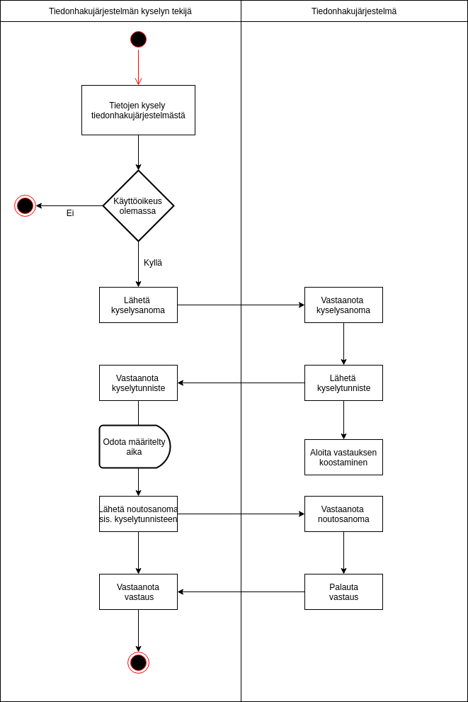

[Käyttöönoton ja ylläpidon ohjeistus tiedonhakujärjestelmä](instructions/Käyttöönoton_ja_ylläpidon_ohjeistus_tiedonhakujärjestelmä.pdf)  
[Deployment and maintenance instructions for the Data Retrieval System](instructions/Deployment_and_maintenance_instructions_for_the_Data_Retrieval_System_EN.pdf)  
[Query interface description of the data retrieval system](index_en.md)  
[Instruktioner för produktionssättning och underhåll av datasöksystemet](instructions/Instruktioner_för_produktionssättning_och_underhåll_av_datasöksystemet_SV.pdf)  
[Beskrivning av datasöksystemets frågegränssnitt](index_sv.md)

# Tiedonhakujärjestelmän kyselyrajapintakuvaus

*Dokumentin versio 2.0.1*

## Versiohistoria

Versio|Päivämäärä|Kuvaus
---|---|---
1.0|21.10.2019|Versio 1.0|
1.0.1|1.11.2019|Päivitetty Investigation Period (InvstgtnPrd, kappale 4.5) käytettäväksi tiedoksi.|
1.0.2|1.11.2019|Lisätty WSDL|
1.0.3|27.11.2019|Korjattu Ccy-elementin pakollisuustieto|
1.0.4|27.11.2019|Lisätty ohjeet ja skeema kiistanalaisten tietojen ilmoittamisesta|
1.0.5|18.12.2019|Alisanoma fin.013 Contract-elementti kuvattu. Lisätty taulukot lukuun 4.3 kuvaamaan pankki- ja maksutilirekisterin tietosisältö sanomakohtaisesti eriteltynä. PartyIdentification41 nimikentän formaatti määritelty. Nimihaun ehtoja tarkennettu. Alisanoma fin.012 AdditionalSearchCriteria poistettu virheellinen pakollisuustieto. Poistettu viittaus OTHER-taulukkoon kyselyparametrien yhteydessä. Tarkennettu investigation period kuvausta. Omistaja-koodin abstraktiotasoa nostettu. Role OwnrTp poistettu virheellinen viittaus Cd-elementtiin. Tarkennettu luonnollisen henkilön palautettavia tietoja. Kuvattu SdBoxAndParties käyttö.
1.0.6|21.1.2020|Selvennetty ReturnIndicator1 käyttöä kun hakutuloksia alisanomalle ei löydy.|
1.0.7|7.2.2020|Korvattu etunimi ja sukunimi täydellisellä nimellä.|
1.0.8|7.2.2020|Poistettu tallelokeron vuokra-ajan alkupäivämäärän pakollisuus|
1.0.9|19.2.2020|Muutettu fin013 Beneficiaries-kentän sisällöksi PersonIdentification5, koska vain luonnolliset henkilöt ovat sallittuja|
1.0.10|5.3.2020|Vahvistettu, että tallelokero on hakukriteerinä käytössä. Päivitetty XML-allekirjoituksen vaatimuksia. Korjattu SchemeNm muotoon SchmeNm.|
1.0.11|5.3.2020|Lainsäädäntöperusteen kuvaus lisätty.|
1.0.12|10.3.2020|Päivitetty vastaussanoman kuvausta tiliin liittyvien roolien osalta.|
1.0.13|12.3.2020|Täydennetty IBAN ja muu tilin yksilöinti tunniste -hakujen tietueiden käyttöä.|
1.0.14|17.3.2020|Päivitetty XML-allekirjoituksen esimerkki.|
1.0.15|17.3.2020|Palautettu fin013 Beneficiaries-kentän sisällöksi PartyIdentification41. Muutettu Contract-kenttä optionaaliseksi.|
1.0.16|26.3.2020|Päivitetty fin.013 skeema ja sen käyttö.|
1.0.17|26.3.2020|Lisätty kuvaus hausta tallelokeron tunnisteella. päivitetty InformationRequestFIN012 versioon fin.012.001.02.|
1.0.18|26.3.2020|Päivitetty oikeushenkilön rekisterinumeron käyttö ja kooditus|
1.0.19|31.3.2020|Tarkennettu termistöä. Lisätty kuvaus pitkien tilitunnisteiden esitystavasta. Poistettu ylimääräinen tekstikappale. Tarkennuksia varmenteiden osapuolista. Tarkennettu allekirjoitusvaatimuksia.
1.0.20|17.4.2020|Lisätty InformationResponseFIN013 Beneficiary-kentälle roolin alkamis- ja päättymispäivät. Päivitetty InformationResponseFIN013 versioon fin.013.001.03.|
1.0.21|20.4.2020|Poistettu mahdollisuus hakea henkilötodistuksen tunnistenumerolla.|
1.0.22|24.4.2020|Päivitetty SearchCriteria1Choice-kentän kuvaus kappaleessa 4.5.|
1.0.23|29.4.2020|Selvennetty kuvaa 2.1. Pankki- ja maksutilitietojen kysely. Lisätty virhekoodeille numerointi.|
1.0.24|5.5.2020|Luvun 4.3 tarkennuksia: maininta luonnollisen henkilön edunsaajatiedosta, maininta tilin osallisista, maininta tallelokeron osallisista.|
1.0.25|6.5.2020|Selvennetty etu- ja sukunimien esitystavan rajoituksia liittyen ISO 20022 auth.001-sanomaan.|
1.0.26|7.5.2020|Korjattu linkitykset kappaleissa 4.2 ja 4.3.|
1.0.27|11.5.2020|Poistettu edunsaajan roolin alkupäivän pakollisuus, päivitetty fin.013 skeema versioon fin.013.001.04.|
1.0.28|14.5.2020|Lisätty tarkennus vastaussanomien kokorajoituksiin.|
1.0.29|28.5.2020|Lisätty Unauthorized-virhekoodi taulukkoon 4.12.1.|
1.0.30|2.6.2020|Korjattu kirjoitusvirheitä ja muotoiluja. Poistettu tarpeettomia kohtia.|
1.0.31|8.6.2020|fin.002.001.02.xsd ja fin.012.001.02.xsd päivityksiä.|
1.0.32|11.6.2020|Uudelleennimetty skeeman fin.012 InfRspnFin012-elementti InfReqFin012-nimiseksi. Päivitetty skeema fin.012 versioon fin.012.001.03.|
1.0.33|12.6.2020|Päivitetty XML-allekirjoituksen muodostamisen vaatimuksia. WSDL päivitetty.|
1.0.34|3.7.2020|Tarkennettu että hakutekijät yrityksen nimi ja luonnollisen henkilön nimi ovat aakkoskoosta riippumattomat.|
1.0.35|23.7.2020|Päivitetty iso20022.org -sivuston linkit.|
1.0.36|13.8.2020|Korjattu Haku yrityksen nimellä -kohtaan yrityksen nimen tagi (Id -> Nm).|
1.0.37|24.8.2020|Lisätty tarkentava huomautus liittyen tietoliikenteessä ja sanomien allekirjoituksissa käytettävien avainten pituuksista.|
1.0.38|24.8.2020|Lisätty kappale "Hakutuloksen alisanomien rajaaminen". Poistettu lauseesta "jokaista hakutulostyyppiä kohti palautetaan enintään yksi hakutulos-alisanoma" sana "enintään".|
1.0.39|25.8.2020|Tietoliikenne- ja allekirjoitusvarmenteen serialNumber attribuuttina sallitaan sekä Y-tunnus että ALV-tunnus.|
1.0.40|17.9.2020|Korjattu fin.002.001.01 sanoman viittauksia fin.002.001.02 versioon|
1.0.41|18.9.2020|Lisätty Vastaussanoman koko on liian suuri -virhe taulukkoon 4.12.1.|
1.0.42|25.9.2020|Korvattu iso20022.org -sivuston linkit viittauksilla paikallisiin tiedostoihin, koska tiedostojen sijainti iso20022.org -sivulla vaihtuu usein.|
1.0.43|20.11.2020|Lisätty Vastaussanoma sisältää useita osumia -virhe taulukkoon 4.12.1.|
1.0.44|27.1.2021|Selvennetty DtAndPlcOfBirth ja DateOrDateTimePeriodChoice elementtien käyttöä.|
2.0.0|22.8.2022|Päivitetty määritelmiä lakimuutoksen mukaisiksi.|
2.0.1|16.9.2022|Päivitetty WSDL- ja esimerkkitiedostoja.|
2.0.2|27.9.2022|Tarkennettu duplikaattien käsittelyä henkilö- ja yrityshaussa lukuun 4.5.|

## Sisällysluettelo

1. [Johdanto](#luku1)  
2. [Pankki- ja maksutilitietojen kysely tiedonhakujärjestelmästä](#luku2)  
3. [Tietoturva](#tietoturva)  
4. [Tiedonhakujärjestelmän kyselyrajapinta](#kyselyrajapinta)   
  4.1 [Kyselyrajapinnan SOAP-operaatioiden sanomarakenne](#4-1)    
  4.2 [Business Application Header (BAH)](#4-2)    
  4.3 [Kyselyrajapinnan sanomat](#4-3)    
  4.4 [BusinessApplicationHeaderV01](#BusinessApplicationHeaderV01)    
  4.5 [InformationRequestOpeningV01](#InformationRequestOpeningV01)    
  4.6 [InformationRequestFIN012](#InformationRequestFIN012)    
  4.7 [InformationRequestResponseV01](#InformationRequestResponseV01)    
  4.8 [InformationResponseSD1V01](#InformationResponseSD1V01)    
  4.9 [InformationResponseFIN002](#InformationResponseFIN002)    
  4.10 [InformationResponseFIN013](#InformationResponseFIN013)   
  4.11 [Id-elementin käyttö](#Id-elementin_kaytto)    
  4.12 [Kyselyrajapinnan WS-sanomaliikenteen skenaariot](#4-12)    
  4.13 [Kiistanalaisten tietojen palauttaminen](#4-13)  
5. [Kyselyjen palauttamien tietojoukkojen rajaukset asiakaskategorioittain](#luku5)  
  5.1 [Asiakaskategoria 1](#5-1)  
    5.1.1 [Henkilöhaku](#5-1-1)  
    5.1.2 [Organisaatiohaku](#5-1-2)  
    5.1.3 [Tilihaku](#5-1-3)  
    5.1.4 [Tallelokerohaku](#5-1-4)  
  5.2 [Asiakaskategoria 2](#5-2)  
    5.2.1 [Henkilöhaku](#5-2-1)  
    5.2.2 [Organisaatiohaku](#5-2-2)  
    5.2.3 [Tilihaku](#5-2-3)  

## 1. Johdanto <a name="luku1"></a>

### 1.1 Termit ja lyhenteet

Lyhenne tai termi|Selite
---|---
Rajapinta|Standardin mukainen käytäntö tai yhtymäkohta, joka mahdollistaa tietojen siirron laitteiden, ohjelmien tai käyttäjän välillä. 
WS (Web Service)|Verkkopalvelimessa toimiva ohjelmisto, joka tarjoaa standardoitujen internetyhteyskäytäntöjen avulla palveluja sovellusten käytettäväksi. Tiedonhakujärjestelmä tarjoaa palveluna tietojen kyselyn.
Endpoint|Rajapintapalvelu, joka on saatavilla tietyssä verkko-osoitteessa
WSDL| (Web Service Description Language) Rakenteellinen kuvauskieli, jolla kuvataan web palvelun tarjoamat toiminnallisuudet.

### 1.2 Dokumentin tarkoitus ja kattavuus

Tämä dokumentti on osa Tullin julkaisemaa määräystä pankki- ja maksutilien valvontajärjestelmästä. Dokumentin tarkoitus on antaa ohjeet tiedonhakujärjestelmän kyselyrajapinnasta. Tätä dokumenttia täydentää tiedonhakujärjestelmän käyttöönoton ja ylläpidon ohje.

### 1.3 Viittaukset

[Tiedonhakujärjestelmän WSDL](wsdl/data-retrieval-system-wsdl.xml)

[ISO 20022 External Code Sets](assets/iso20022org/ExternalCodeSets_2Q2020_August2020_v1.xlsx)

[ISO 20022 auth.001.001.01 InformationRequestOpeningV01 MDR](assets/iso20022org/archive_business_area_authorities.zip)

[ISO 20022 auth.002.001.01 InformationRequestResponseV01 MDR](assets/iso20022org/archive_business_area_authorities.zip)

[ISO 20022 head.001.001.01 skeema](assets/iso20022org/archive_business_area_business_application_header.zip)

[fin.002.001.02](schemas/fin.002.001.02.xsd)

[fin.012.001.03](schemas/fin.012.001.03.xsd)

[fin.013.001.04](schemas/fin.013.001.04.xsd)

[Sähköisen asioinnin tietoturvallisuus -ohje](http://julkaisut.valtioneuvosto.fi/bitstream/handle/10024/80012/VM_25_2017.pdf)

### 1.4 Yleiskuvaus

Tulli on perustanut Tilirekisterihankkeen, joka toteuttaa (EU) 2018/843 direktiivin ja sen täytäntöön panemiseksi säädetyn, Suomen lainsäädäntöön perustuvan pankki- ja maksutilien valvontajärjestelmän. 

Tässä dokumentissa kuvataan tiedonhakujärjestelmän kyselyrajapinnat.

## 2. Pankki- ja maksutilitietojen kysely tiedonhakujärjestelmästä <a name="luku2"></a>

Tässä luvussa on kuvattu pankki- ja maksutilitietojen kysely tiedonhakujärjestelmästä.

Viranomaisten järjestelmissä  on olemassa rajoituksia yksittäisen sanoman koolle.

Toimijat voivat käyttöönoton yhteydessä keskenään sopia sanomien kokorajasta sekä keinoista, millä tavoin yksittäisen sanoman kokoa voidaan tarvittaessa pienentää tai vaihtoehtoisesta menetelmästä satunnaisten ylisuurten sanomien toimittamiseen.

Kuvassa 2.1 on esitetty vuokaaviona pankki- ja maksutilitietojen kysely tiedonhakujärjestelmästä.

  
*__Kuva2.1.__ Pankki- ja maksutilitietojen kysely*  

Kuvasta nähdään, että kyselyrajapinta mahdollistaa sekä vastauksen palauttamisen heti synkronisesti, tai vaihtoehtoisesti asynkronisesti. 

Taulukossa 2.1. on esitetty vuokaavion muuttujien merkitys. 

*__Taulukko 2.1.__ Vuokaavion muuttujat*

|Muuttuja|Kuvaus|
|:--|:--|
|POLLING_INTERVAL|Pollausväli, viive joka clientin on odotettava ennen seuraavaa kyselyä. Jos client pollaa serveriä liian tiheästi, voi server hylätä transaktion käsittelyn (virhekoodi 3, ks [4.12](#4-12)).|
|RETRY_LIMIT|Kuinka monta pollausta on sallittua tehdä, ennen kuin lopetetaan. Jos vastausta ei edelleenkään saada, on joko tehtävä kokonaan uusi kysely tai siirrettävä asia manuaaliseen käsittelyyn.|

Taulukossa 2.1. esitettyjen muuttujien kulloinkin voimassa olevat arvot kerrotaan liitedokumentaatiossa.

Kyselyn vuo kulkee seuraavasti:
1. Client lähettää kyselysanoman
2. Server voi kyvykkyydestä ja kontekstista riippuen palauttaa hakutulokset joko synkronisesti tai asynkronisesti. Server joko  
  a. Palauttaa vastaussanoman, joka sisältää hakutuloksen ja koodin *COMP*, esimerkiksi viiden (5) sekunnin sisällä, tai  
  b. palauttaa vastaussanoman, joka sisältää koodin *NRES* 
3. Client tarkistaa onko vastaussanomassa koodi *COMP* vai *NRES*
4. Jos koodi on *COMP*, siirrytään kohtaan 10.
5. Koodi on *NRES*. Client odottaa *POLLING_INTERVAL* muuttujan määrittämän ajan ja tekee sen jälkeen kyselyn request #2
6. Server, joko  
  a. Palauttaa hakutuloksen ja koodin *COMP*, tai  
  b. palauttaa vastaussanoman, joka sisältää koodin *NRES* 
7. Client tarkistaa onko vastaussanomassa koodi *COMP* vai *NRES*
8. Jos koodi on *COMP*, siirrytään kohtaan 10.
9. Koodi on *NRES*. Jos *RETRY_LIMIT* ei ole saavutettu, siirrytään kohtaan 5.  
10. Loppu.
 
Taulukossa 2.2. on kuvattu StatusResponse1Code arvojen käyttö

*__Taulukko 2.2.__ StatusResponse1Code arvojen käyttö*

|Koodi|Nimi|Määritelmä|Kuvaus|
|:--|:--|:--|:--|
|COMP|CompleteResponse|Response is complete.|Vastaussanoma sisältää hakutulokset|
|NRES|NoResponseYet|Response not provided yet.|Vastaussanoma ei sisällä hakutuloksia, tee uusi kysely myöhemmin.|
|PART|PartialResponse|Response is partially provided.|Ei käytössä|

## <a name="tietoturva"></a> 3. Tietoturva
  
### 3.1 Tunnistaminen

Taulukossa 3.1. on esitetty varmenteet tiedonhakujärjestelmässä.

*__Taulukko 3.1.__ Tiedonhakujärjestelmän varmenteet*

|Standardi|Varmenteen nimi|Käyttötarkoitus|
|:--|:--|:--|
|X.509 (versio 3)|Tiedonhakujärjestelmän tietoliikennevarmenne|Rajapinnan hyödyntäjän ja tiedon luovuttajan tai tiedon luovuttajan valtuuttaman tahon tunnistaminen|
|X.509 (versio 3)|Tiedonhakujärjestelmän allekirjoitusvarmenne|Sanoman allekirjoittaminen, sanoman muuttumattomuuden varmistaminen, tiedon luovuttajan tunnistaminen|

Tiedonhakujärjestelmän kyselyrajapinnan hyödyntäjät sekä tiedon luovuttajat tai tiedon luovuttajan valtuuttamat tahot tunnistetaan X.509-varmenteilla (Tietoliikennevarmenne). Kyselyrajapinnan kysely- ja vastaussanomat allekirjoitetaan XML-allekirjoituksella (Allekirjoitusvarmenne).

#### Tiedon luovuttajan allekirjoitusvarmenne

Tiedon luovuttajan on allekirjoitettava lähettämänsä sanomat käyttäen x.509 palvelinvarmennetta, josta käy ilmi ko. tiedon luovuttajan Y-tunnus tai ALV-tunnus. Saapuvien sanomien allekirjoitus on tarkistettava. Vastaanottaja ei saa hyväksyä sanomaa ilman hyväksyttävää allekirjoitusta. Allekirjoituksen hyväksyminen edellyttää, että XML-allekirjoitus on validi ja että

joko  
a) varmenne on VRK:n myöntämä, voimassa, eikä esiinny VRK:n ylläpitämällä sulkulistalla ja varmenteen kohteen serialNumber attribuuttina on kyseisen tiedon luovuttajan Y-tunnus tai ALV-tunnus

tai  
b) varmenne on eIDAS-hyväksytty sivustojen tunnistamisvarmenne, voimassa, eikä esiinny varmenteen tarjoajan ylläpitämällä ajantasaisella sulkulistalla ja varmenteen kohteen organizationIdentifier-attribuuttina on kyseisen tiedon luovuttajan Y-tunnus tai ALV-tunnus.

Huom. Jotta sanomien allekirjoitukset täyttävät alla viitatut Kyberturvallisuuskeskuksen tietoturvavaatimukset, tulee allekirjoituksiin käytettävän varmenteen julkisen avaimen (RSA public key) olla vähintään 3072 bittinen. Allekirjoituksiin käytettävän varmenteen käyttötarkoituksiin myös kuulua ”digitaalinen allekirjoitus”. Nämä seikat tulee huomioida varmennetta tilattaessa.

#### Toimivaltaisen viranomaisen allekirjoitusvarmenne

Toimivaltaisen viranomaisen on allekirjoitettava lähettämänsä sanomat käyttäen x.509 palvelinvarmennetta, josta käy ilmi ko. viranomaisen Y-tunnus. Saapuvien sanomien allekirjoitus on tarkistettava. Vastaanottaja ei saa hyväksyä sanomaa ilman hyväksyttävää allekirjoitusta. Toimivaltaisen viranomaisen allekirjoituksen hyväksyminen edellyttää, että XML-allekirjoitus on validi ja että  
a) varmenne on VRK:n myöntämä, voimassa, eikä esiinny VRK:n ylläpitämällä sulkulistalla  
b) varmenteen kohteen serialNumber attribuuttina on sanoman lähettäneen toimivaltaisen viranomaisen Y-tunnus tai tunnus, joka muodostuu kirjaimista “FI” ja Y-tunnuksen numero-osasta ilman väliviivaa (ALV-tunnuksen muotoinen tunnus).

#### Yhteydenottajan tietoliikennevarmenne

Tiedon luovuttaja tai tiedon luovuttajan valtuuttama taho tunnistaa toimivaltaisen viranomaisen, joka ottaa yhteyden tiedonhakujärjestelmän kyselyrajapintaan, palvelinvarmenteen avulla. Yhteys toimivaltaiselta viranomaiselta on hyväksyttävä seuraavin edellytyksin: 
a) Toimivaltaisen viranomaisen varmenteen on myöntänyt VRK  
b) varmenne on voimassa, eikä esiinny VRK:n sulkulistalla  
c) varmenteen kohteen serialNumber attribuuttina on toimivaltaisen viranomaisen tai sen puolesta toimivan valtion palvelukeskuksen Y-tunnus tai tunnus, joka muodostuu kirjaimista “FI” ja Y-tunnuksen numero-osasta ilman väliviivaa (ALV-tunnuksen muotoinen tunnus).

#### Tiedon luovuttajan tai tiedon luovuttajan valtuuttaman tahon tietoliikennevarmenne

Toimivaltainen viranomainen, joka ottaa yhteyden kyselyrajapintaan, tunnistaa tiedon luovuttajan tai tiedon luovuttajan valtuuttaman tahon palvelinvarmenteen avulla. Tiedon luovuttajan valtuuttamalla taholla tarkoitetaan esim. palvelukeskusta, jonka tiedon luovuttaja on valtuuttanut puolestaan huolehtimaan ilmoitusten muodostamisesta ja/tai lähettämisestä.

Yhteys tiedon luovuttajaan on hyväksyttävä seuraavin edellytyksin:

joko  
a) palvelinvarmenteen on myöntänyt VRK, varmenne on voimassa, eikä esiinny VRK:n sulkulistalla, varmenteen kohteen serialNumber attribuuttina on kyseisen tiedon luovuttajan tai tiedon luovuttajan valtuuttaman tahon Y-tunnus tai ALV-tunnus

tai  
b) palvelinvarmenne on eIDAS-hyväksytty sivustojen tunnistamisvarmenne, voimassa, eikä esiinny varmenteen tarjoajan ylläpitämällä ajantasaisella sulkulistalla ja varmenteen kohteen organizationIdentifier-attribuuttina on kyseisen tiedon luovuttajan tai tiedon luovuttajan valtuuttaman tahon Y-tunnus tai ALV-tunnus.

Mikäli tiedon luovuttajan tietoliikennevarmenteessa ja lähtevän sanoman allekirjoitusvarmenteessa käytetään samaa Y-tunnusta tai ALV-tunnusta, voidaan kumpaankin tarkoitukseen käyttää samaa varmennetta.

Huom. Jotta tietoliikenteen suojaus täyttää alla viitatut Kyberturvallisuuskeskuksen tietoturvavaatimukset, tulee käytettävän varmenteen julkisen avaimen (RSA public key) olla vähintään 3072 bittinen. Tämä tulee huomioida varmennetta tilattaessa.

#### <a name="xml-sig"></a> XML-allekirjoituksen muodostaminen

Allekirjoituksen tyyppi on __enveloped signature__. Signature-elementti sijoitetaan [BAHin](#BusinessApplicationHeaderV01) Sgntr-elementin alle.

Esimerkki 3.1. Esimerkki SignedInfo
```
<SignedInfo>
  <CanonicalizationMethod Algorithm="http://www.w3.org/2001/10/xml-exc-c14n#" />
  <SignatureMethod Algorithm="http://www.w3.org/2001/04/xmldsig-more#rsa-sha256" />
  <Reference URI="#applicationRequest">
    <Transforms>
      <Transform Algorithm="http://www.w3.org/2000/09/xmldsig#enveloped-signature" />
      <Transform Algorithm="http://www.w3.org/2001/10/xml-exc-c14n#" />
    </Transforms>
    <DigestMethod Algorithm="http://www.w3.org/2001/04/xmlenc#sha256" />
    <DigestValue />
  </Reference>
</SignedInfo>
```

Allekirjoitusalgoritmi on siis RSA-SHA256 ja C14N on Exclusive XML Canonicalization. Reference URI on joko "#applicationRequest" tai "#applicationResponse", riippuen onko kyseessä kysely- vai vastaussanoma. Eli vain "ApplicationRequest" tai "ApplicationResponse" elementti allekirjoitetaan. Allekirjoitusta muodostettaessa laskettavien tiivisteiden (Digest) muodostamiseen tulee käyttää SHA256 -algoritmia.

Allekirjoituksessa käytettyjen kryptografisten algoritmien on vastattava kryptografiselta vahvuudeltaan vähintään Viestintäviraston määrittelemiä kryptografisia vahvuusvaatimuksia kansalliselle suojaustasolle ST IV. Tämänhetkiset vahvuusvaatimukset on kuvattu dokumentissa https://www.kyberturvallisuuskeskus.fi/sites/default/files/media/regulation/ohje-kryptografiset-vahvuusvaatimukset-kansalliset-suojaustasot.pdf (Dnro: 190/651/2015).

Mahdollisuus pyyntöjen IP-avaruuden rajoittamiseen tiedonhakujärjestelmässä tarkennetaan myöhemmin.

### 3.2 Yhteyksien suojaaminen

Tiedonhakujärjestelmän kyselyrajapinnan yhteydet on suojattava TLS-salauksella käyttäen TLS-protokollan versiota 1.2 tai korkeampaa. Yhteyden molemmat päät tunnistetaan yllä kuvatuilla palvelinvarmenteilla käyttäen kaksisuuntaista kättelyä. Yhteys on muodostettava käyttäen ephemeral Diffie-Hellman (DHE) avaintenvaihtoa, jossa jokaiselle sessiolle luodaan uusi uniikki yksityinen salausavain. Tämän menettelyn tarkoituksena on taata salaukselle forward secrecy -ominaisuus, jotta salausavaimen paljastuminen ei jälkikäteen johtaisi salattujen tietojen paljastumiseen.

TLS-salauksessa käytettyjen kryptografisten algoritmien on vastattava kryptografiselta vahvuudeltaan vähintään Viestintäviraston määrittelemiä kryptografisia vahvuusvaatimuksia kansalliselle suojaustasolle ST IV. Tämänhetkiset vahvuusvaatimukset on kuvattu dokumentissa https://www.kyberturvallisuuskeskus.fi/sites/default/files/media/regulation/ohje-kryptografiset-vahvuusvaatimukset-kansalliset-suojaustasot.pdf (Dnro: 190/651/2015).

### 3.3 Sallittu HTTP-versio

Tiedonhakujärjestelmän kyselyrajapinnan yhteydet käyttävät HTTP-protokollan versiota 1.1.

### 3.4 Tietoturvapoikkeamien ilmoitusvelvollisuus

Mikäli tiedonhakujärjestelmän toteuttajan varmenteet tai näiden salaiset avaimet vaarantuvat on tästä ilmoitettava välittömästi varmenteen myöntäjälle ja niille toimivaltaisille viranomaisille, jotka hyödyntävät tiedonhakujärjestelmää. Toimivaltaisille viranomaisille on ilmoitettava myös, jos tiedonhakujärjestelmässä havaitaan tietoturvapoikkeama

Mikäli tiedonhakujärjestelmää hyödyntävän toimivaltaisen viranomaisen varmenteet tai näiden salaiset avaimet vaarantuvat on tästä ilmoitettava välittömästi varmenteen myöntäjälle ja niille tiedonhakujärjestelmän toteuttajille, joiden toteutusta tiedonhakujärjestelmästä kyseinen toimivaltainen viranomainen hyödyntää.

## <a name="kyselyrajapinta"></a> 4. Tiedonhakujärjestelmän kyselyrajapinta

Kyselyrajapinta toteutetaan SOAP/XML Web Servicenä, josta julkaistaan [WSDL](wsdl/data-retrieval-system-wsdl.xml).

SOAP-protokollasta käytetään versiota 1.1.

Sanomissa käytetään ISO 20022 koodistoviittauksia. Koodistoviittaukset löytyvät ISO 20022 sivulta [External Code Sets](assets/iso20022org/ExternalCodeSets_2Q2020_August2020_v1.xlsx).

Kyselyrajapinnassa on yksi endpoint, jonka kysely- ja vastaussanomarakenne on kuvattu tässä luvussa.

### <a name="4-1"></a> 4.1 Kyselyrajapinnan SOAP-operaatioiden sanomarakenne

SOAP body koostuu aina kahdesta osasta, ISO 20022 Business Application Headerista (BAH) ja varsinaisesta business-sanomasta.  

### <a name="4-2"></a> 4.2 Business Application Header (BAH) 

Business Application Header sanoman tiedot on esitetty seuraavassa taulukossa.

|Sanoma-id|Sanoman nimi|
|:---|:---|
|[head.001.001.01](assets/iso20022org/archive_business_application_header_2.zip)|Business Application Header|

BAH on oltava aina SOAP bodyn ensimmäinen elementti.

### <a name="4-3"></a> 4.3 Kyselyrajapinnan sanomat

Tiedonhakujärjestelmän kyselyrajapinnassa käytetään ISO 20022 -sanomia [InformationRequestOpeningV01 (auth.001.001.01)](assets/iso20022org/auth.001.001.01.xsd) ja [InformationRequestResponseV01 (auth.002.001.01)](assets/iso20022org/auth.002.001.01.xsd), joihin liitetään tarvittavat alisanomat ([Supplementary Data](assets/iso20022org/InformationResponse_SupplementaryData.zip)).

Ylätasolla käytettävät alisanomat jakautuvat kolmeen käsitteeseen: asiakkuus, tili ja tallelokero. Asiakkuus- ja edunsaajatiedot palautetaan sanomassa [fin.013.001.04](schemas/fin.013.001.04.xsd), tilitiedot sanomassa [supl.027.001.01](assets/iso20022org/InformationResponse_SupplementaryData.zip) ja tallelokerotiedot sanomassa [fin.002.001.02](schemas/fin.002.001.02) (huom. tässä sama koodi eräiden olemassaolevien järjestelmien manuaalisen käsittelyn kanssa). Nämä alisanomat liitetään [auth.002.001.01](assets/iso20022org/auth.002.001.01.xsd) elementtiin `InformationRequestResponseV01/RtrInd`.

Taulukoissa *4.3.1*-*4.3.5* on esitetty pankki- ja maksutilirekisterin tietosisältö, sekä Supplementary Data -alisanoma, jonka osana kukin tieto palautetaan.  

Taulukossa *4.3.6*-*4.3.8* on esitetty ISO 20022 -katalogin mukaiset auth-sanomat, sekä niihin liitettävät alisanomat.

Tarkemmat sanomakuvaukset ovat tämän luvun aliluvuissa 4.4 alkaen.

*__Taulukko 4.3.1:__ Luonnollinen henkilö, tiedot sanomakohtaisesti eriteltynä*

|Tieto|Sanoma(t)|Kuvaus|
|:---|:---|:---|
|Täydellinen nimi|fin.002, fin.013, supl.027|Palautetaan rooliin liitetyssä Pty/Nm-elementissä, lähdejärjestelmän formaatissa. Jotta saavutetaan yhteensopivuus olemassaolevien järjestelmien kanssa, on käytettävä yhtä nimikenttää esittämään henkilön kaikki nimet. Tämän elementin formaattia etu- ja sukunimien suhteen ei ole tarkasti määritelty ISO 20022 -sanomatoteutuksissa, jotka on tiedonhakurajapinnan määrittelytyön pohjaksi annettu (auth.001: Document/InfReqOpng/SchCrit/CstmrId/Pty/Nm). Lisäksi on huomioitava, ettei etu- ja/tai sukunimeä esiinny globaalisti kaikilla henkilöillä.|
|Syntymäaika|fin.002, fin.013, supl.027|Palautetaan rooliin liitetyn Id-elementin osana ks. [Id-elementin käyttö](#Id-elementin_kaytto)|
|Henkilötunnus|fin.002, fin.013, supl.027|Palautetaan rooliin liitetyn Id-elementin osana ks. [Id-elementin käyttö](#Id-elementin_kaytto)|
|Kansalaisuudet|fin.002, fin.013, supl.027|Palautetaan rooliin liitetyn Id-elementin osana ks. [Id-elementin käyttö](#Id-elementin_kaytto)|
|Edunsaaja|fin.013|Organisaatiot, joissa luonnollinen henkilö on edunsaajana|
|Kiistanalainen|auth.002|[disputed-skeeman](schemas/disputed.xsd) mukainen Supplementary Data|

*__Taulukko 4.3.2:__ Oikeushenkilö, tiedot sanomakohtaisesti eriteltynä*

|Tieto|Sanoma(t)|Kuvaus|
|:---|:---|:---|
|Nimi|fin.002, fin.013, supl.027|Palautetaan rooliin liitetyssä Pty/Nm-elementissä|
|Rekisterinumero|fin.002, fin.013, supl.027|Palautetaan rooliin liitetyn Id-elementin osana ks. [Id-elementin käyttö](#Id-elementin_kaytto)|
|Rekisteriviranomainen|fin.002, fin.013, supl.027|Palautetaan rooliin liitetyn Id-elementin osana ks. [Id-elementin käyttö](#Id-elementin_kaytto)|
|Rekisteröitymispäivä|fin.002, fin.013, supl.027|Palautetaan rooliin liitetyn Id-elementin osana ks. [Id-elementin käyttö](#Id-elementin_kaytto)|
|Toimijan yksilöivä tunniste|fin.002, fin.013, supl.027|Palautetaan rooliin liitetyn Id-elementin osana ks. [Id-elementin käyttö](#Id-elementin_kaytto)|
|Kiistanalainen|auth.002|[disputed-skeeman](schemas/disputed.xsd) mukainen Supplementary Data|

*__Taulukko 4.3.3:__ Pankki- ja  maksutili, tiedot sanomakohtaisesti eriteltynä*

|Tieto|Sanoma(t)|Kuvaus|
|:---|:---|:---|
|IBAN-numero|supl.027|Ks. [CustomerAccount-käyttö](#CustomerAccount1)|
|Tilin avaamispäivä|supl.027|Palautetaan AddtlInf-kentässä|
|Tilin sulkemispäivä|supl.027|Ks. [CustomerAccount-käyttö](#CustomerAccount1)|
|Tilin osalliset|supl.027|Tilin haltijat ja tilin käyttöoikeuden haltijat|
|Tilin käyttötarkoitus|supl.027|Ks. [CustomerAccount-käyttö](#CustomerAccount1)|
|Kiistanalainen|auth.002|[disputed-skeeman](schemas/disputed.xsd) mukainen Supplementary Data|

*__Taulukko 4.3.4:__ Tallelokero, tiedot sanomakohtaisesti eriteltynä*

|Tieto|Sanoma(t)|Kuvaus|
|:---|:---|:---|
|Yksilöintitieto|fin.002|ks. [SafetyDepositBoxAndParties käyttö](#SafetyDepositBoxAndParties)|
|Vuokra-ajan alkamispäivämäärä|fin.002|ks. [SafetyDepositBoxAndParties käyttö](#SafetyDepositBoxAndParties)|
|Vuokra-ajan päättymispäivämäärä|fin.002|ks. [SafetyDepositBoxAndParties käyttö](#SafetyDepositBoxAndParties)|
|Tallelokeron osalliset|fin.002|Tallelokeron haltijat ja tallelokeron käyttöoikeuden haltijat|
|Kiistanalainen|auth.002|[disputed-skeeman](schemas/disputed.xsd) mukainen Supplementary Data|

*__Taulukko 4.3.5:__ Asiakkuus, tiedot sanomakohtaisesti eriteltynä*

|Tieto|Sanoma(t)|Kuvaus|
|:---|:---|:---|
|Asiakkuus|fin.013|Ks. [InformationResponseFIN013](#InformationResponseFIN013)|
|Alkamispäivämäärä|fin.013|Ks. [InformationResponseFIN013](#InformationResponseFIN013)|
|Päättymispäivämäärä|fin.013|Ks. [InformationResponseFIN013](#InformationResponseFIN013)|
|Kiistanalainen|auth.002|[disputed-skeeman](schemas/disputed.xsd) mukainen Supplementary Data|


*__Taulukko 4.3.6:__ ISO 20022 katalogin mukaiset auth-sanomat*

|Sanoma-id|Sanoman nimi|Käyttötarkoitus|Vastaava organisaatio|Msg Def Report|
|---|---|---|---|---| 
|auth.001.001.01|InformationRequestOpeningV01|Kyselyrajapinnan kyselysanoma|FFI|[MDR](assets/iso20022org/archive_business_area_authorities.zip)|
|auth.002.001.01|InformationRequestResponseV01|Kyselyrajapinnan vastaussanoma|FFI|[MDR](assets/iso20022org/archive_business_area_authorities.zip)|


*__Taulukko 4.3.7:__ Kyselysanomaan auth.001 liitettävä alisanoma*

|Sanoma-id|Sanoman nimi|Laajennettavan ISO 20022 sanoman id|Tarkoitus ja toiminnallisuus|
|---|---|---|---|
|FIN012|InformationRequestFIN012|auth.001.001.01|ISO 20022 sanomalaajennus. Kyselyrajapinnan toimivaltaiset viranomaiset käyttävät tätä sanomaa tietojen kyselyyn tiedonhakurajapinnasta. Sisältää kyselyn tekevän henkilön ja henkilön esimiehen tunnisteet. Mahdollistaa auth.001.001.01 puuttuvien hakukriteerien käytön (esim. tallelokero)|

*__Taulukko 4.3.8:__ Vastaussanomaan auth.002 liitettävät alisanomat*

|Sanoma-id|Sanoman nimi|Laajennettavan ISO 20022 sanoman id|Tarkoitus ja toiminnallisuus|
|---|---|---|---|
|supl.027.001.01|InformationResponseSD1V01|auth.002.001.01|Sisältää hakuparametreja vastaavat tilitiedot|
|FIN002|InformationResponseFIN002|auth.002.001.01|Sisältää hakuparametreja vastaavat tallelokerotiedot|
|FIN013|InformationResponseFIN013|auth.002.001.01|Sisältää tili- ja tallelokerotiedoista erillisenä hakuparametreja vastaavat asiakkuustiedot|

Kyselyrajapinnan sanomavastauksiin sisällytetään kaikki hakukriteereitä vastaavat tiedot, joiden ajallinen ulottuvuus johdetaan rahanpesun ja terrorismin rahoittamisen estämistä koskevan lain 3 luvun 3 §:stä, jossa on täsmällisesti ja tarkkarajaisesti säädetty asiakkaan tuntemistiedot ja niiden säilyttämisestä. Tileihin ja tallelokeroihin liittyvät kaikki osallisuustiedot palautetaan, eli kyselyparametrina annetun hakuehdon mukaisten henkilöiden (oikeus- tai luonnollinen) lisäksi palautetaan myös kaikki osalliset henkilöt. Osallisten henkilöiden muita kuin kyselyn hakuparametria vastaavia tilejä ja tallelokeroita sen sijaan ei palauteta, vaan niitä koskien on tehtävä uudet kyselyt lainsäädäntöperusteineen.

### <a name="BusinessApplicationHeaderV01"></a> 4.4 BusinessApplicationHeaderV01

Seuraavassa taulukossa on esitetty BAH-elementtien käyttö. Elementtien tyypit on kuvattu [head.001.001.01-skeemassa](assets/iso20022org/archive_business_area_business_application_header.zip).

|Nimi|Tyyppi|Käytössä|Kuvaus|
|:---|:---|:---|:---|
|BusinessApplicationHeaderV01| | | |
|CharSet|UnicodeChartsCode|kyllä|"UTF-8"|
|Fr|Party9Choice|kyllä|Käytetään seuraavasti: Elementti `Fr/OrgId/Id/OrgId/Othr/SchmeNm/Cd` sisältää arvon "Y" ja elementti `Fr/OrgId/Id/OrgId/Othr/Id` sisältää lähettäjän Y-tunnuksen.|
|To|Party9Choice|kyllä|Käytetään seuraavasti: Elementti `To/OrgId/Id/OrgId/Othr/SchmeNm/Cd` sisältää arvon "Y" ja elementti `To/OrgId/Id/OrgId/Othr/Id` sisältää vastaanottajan Y-tunnuksen (Esim. Tiedonhakujärjestelmässä Y-tunnus 0245442-8)|
|BizMsgIdr|Max35Text|kyllä|Käyttö standardin mukaisesti.|
|MsgDefIdr|Max35Text|kyllä|Sisältää sanoma-id:n. Kyselysanomassa käytetään "auth.001.001.01", vastaussanomassa sisältönä on "auth.002.001.01"|
|BizSvc||ei||
|CreDt|ISONormalisedDateTime|kyllä|BAH:n luomis päivämäärä ja aika. Normalisoitava Z-notaatiolla (UTC).|
|CpyDplct||ei| |
|PssblDplct| |ei| |
|Prty| |ei| |
|Sgntr| |kyllä|Business messagen lähettäjän muodostama XML-allekirjoitus. Ks. [XML-allekirjoituksen muodostaminen](#xml-sig)|
|Rltd|BusinessApplicationHeader1|kyllä|Käytössä vastaussanomassa, sisältää kyselysanoman sisältämän BAH:in.|

### <a name="InformationRequestOpeningV01"></a> 4.5 InformationRequestOpeningV01

Taulukossa on kuvattu sanoman tietueiden käyttö.

|Nimi|Tyyppi|Käytössä|Kuvaus|
|:---|:---|:---|:---|
|InformationRequestOpeningV01| | | |
|&nbsp;&nbsp;&nbsp;&nbsp;InvstgtnId|Max35Text|Kyllä|Tutkinnan case id|
|&nbsp;&nbsp;&nbsp;&nbsp;LglMndtBsis|LegalMandate1|Kyllä|Lainsäädäntöperuste. Numeroarvo välillä 100..n. Ensimmäiset numerot kertovat viranomaisen ja kaksi viimeistä numeroa lainsäädäntöperusteen. Lainsäädäntöperusteita kootaan Finanssiala Ry:n kanssa sovitun mukaisesti viranomaisten yhteisesti ylläpitämään kooditaulukkoon. Taulukko toimitetaan tiedonhakujärjestelmän toteuttajille sopimusneuvottelujen yhteydessä (taulukko ei ole julkinen).|
|&nbsp;&nbsp;&nbsp;&nbsp;CnfdtltySts|YesNoIndicator|Kyllä|Aina "true"|
|&nbsp;&nbsp;&nbsp;&nbsp;DueDt|DueDate1|Ei||
|&nbsp;&nbsp;&nbsp;&nbsp;InvstgtnPrd|DateOrDateTimePeriodChoice|Kyllä|Päivä tai päivämääräväli, johon haku kohdistuu. Päivämääräväli on aina tänään tai menneisyydessä. Aikavälihaku on sisällyttävä siten, että jos jokin tietosisältöön määritetty aikaväli (kaikki taulukoiden 4.3.1-4.3.5 päivämäärätietueet) sisältyy osittain tai kokonaan annettuun InvstgtnPrd-aikaväliin, on kyseinen tietorivi lisättävä hakutulokseen. Käytetään vain Dt elementtiä. |
|&nbsp;&nbsp;&nbsp;&nbsp;SchCrit|SearchCriteria1Choice|Kyllä|Hakukriteeri. Käytettävä aina mahdollisimman täsmällistä hakukriteeriä. Ks. [tarkempi erittely](#SearchCriteria1Choice) alla.|
|&nbsp;&nbsp;&nbsp;&nbsp;SplmtryData|SupplementaryData1|Kyllä|Sisältää sanomalaajennuksen [InformationRequestFIN012](#InformationRequestFIN012)|

#### <a name="SearchCriteria1Choice"></a> Hakutuloksen alisanomien rajaaminen

Järjestelmä palauttaa ainoastaan hakukriteereissä pyydetyt alisanomat (supl.027.001.01, fin.002.001.02, fin.013.001.04). Kutakin alisanomaa pyydetään erillisessä AuthorityRequestType1 -tyyppisessä elementissä, joita siis tulee esiintyä hakukriteereissä 1-3 kappaletta.

|Tagi|Skeeman polku InfReqOpng/SchCrit/|Kuvaus|Sääntö|
|:---|:---|:---|:---|
|\<MsgNmId\>|Haku henkilötunnuksella, luonnollisen henkilön nimi, kansalaisuus ja syntymäaika -yhdistelmällä, oikeushenkilön rekisterinumerolla, yrityksen nimellä tai tallelokeron tunnisteella:<br/>CstmrId/AuthrtyReq/Tp<br/><br/>Haku IBANilla tai muulla tilin yksilöintitunnuksella:<br/>Acct/AuthrtyReqTp|"supl.027.001.01", "fin.002.001.02" tai "fin.013.001.04"||

#### <a name=""></a> Haku henkilötunnuksella

|Tagi|Skeeman polku InfReqOpng/SchCrit/|Kuvaus|Sääntö|
|:---|:---|:---|:---|
|\<Id\>|CstmrId/Pty/Id/PrvtId/Othr|Hetu|Validi henkilötunnus.|
|\<Cd\>|CstmrId/Pty/Id/PrvtId/Othr/SchmeNm|"PIC" (Person Identification Code, hetu)|
|\<Cd\>|CstmrId/AuthrtyReq/InvstgtdRoles|"ALLP"|

#### <a name=""></a> Haku oikeushenkilön rekisterinumerolla

|Tagi|Skeeman polku InfReqOpng/SchCrit/|Kuvaus|Sääntö|
|:---|:---|:---|:---|
|\<Id\>|CstmrId/Pty/Id/OrgId/Othr|Y-tunnus tai muu oikeushenkilön tunniste|| |
|\<Cd\>|CstmrId/Pty/Id/OrgId/Othr/SchmeNm|"COID"| |
|\<Cd\>|CstmrId/AuthrtyReq/InvstgtdRoles|"ALLP"| |


#### <a name=""></a> Haku yrityksen nimellä

|Tagi|Skeeman polku InfReqOpng/SchCrit/|Kuvaus|Sääntö|
|:---|:---|:---|:---|
|\<Nm\>|CstmrId/Pty|Yrityksen nimi|Täsmällinen osuma 1:1. Aakkoskoosta riippumaton.|
|\<Id\>|CstmrId/Pty/Id/OrgId/Othr|Arvoksi asetetaan "1"|
|\<Cd\>|CstmrId/Pty/Id/OrgId/Othr/SchmeNm|"NAME"|
|\<Cd\>|CstmrId/AuthrtyReq/InvstgtdRoles|"ALLP"|

Jos annetuilla hakukriteereillä löytyy useampi kuin yksi niitä vastaava yritys, palautetaan virhekoodi 7 (ks. [virhekoodit](#4-12)).

#### <a name=""></a> Haku IBANilla

|Tagi|Skeeman polku InfReqOpng/SchCrit/|Kuvaus|
|:---|:---|:---|
|\<IBAN\>|Acct/Id/Id|IBAN|
|\<Cd\>|Acct/InvstgtdPties|"ALLP"|

#### <a name=""></a> Haku muulla tilin yksilöintitunnuksella

|Tagi|Skeeman polku InfReqOpng/SchCrit/|Kuvaus|
|:---|:---|:---|
|\<Id\>|Acct/Id/Id/Othr|Tilin muu yksilöintitunnus|
|\<Cd\>|Acct/Id/Id/Othr/SchmeNm|OTHR|
|\<Cd\>|Acct/InvstgtdPties|"ALLP"|

#### <a name=""></a> Haku luonnollisen henkilön nimi, kansalaisuus ja syntymäaika -yhdistelmällä

|Tagi|Skeeman polku InfReqOpng/SchCrit/|Kuvaus|Sääntö|
|:---|:---|:---|:---|
|\<Nm\>|CstmrId/Pty|Nimi|Täsmällinen osuma 1:1, ml. erikoismerkit. Aakkoskoosta riippumaton. Formaatti on vapaamuotoinen.|
|\<Id\>|CstmrId/Pty/Id/PrvtId/Othr|Maakoodi|
|\<Cd\>|CstmrId/Pty/Id/PrvtId/Othr/SchmeNm|"NATI"|
|\<BirthDt\>|CstmrId/Pty/Id/PrvtId/DtAndPlcOfBirth|Syntymäaika. `CtryOfBirth` arvoksi asetetaan "XX" ja `CityOfBirth` arvoksi asetetaan ”not in use”|
|\<Cd\>|CstmrId/AuthrtyReq/InvstgtdRoles|"ALLP"|

Jos annetuilla hakukriteereillä löytyy useampi kuin yksi niitä vastaava henkilö, palautetaan virhekoodi 7 (ks. [virhekoodit](#4-12)).

#### <a name=""></a> Haku Tallelokeron tunnisteella

ISO-sanoman rajoitusten vuoksi Document/InfReqOpng/SchCrit on täytettävä jokin valinta. Täytetään CstmrId:

|Tagi|Skeeman polku InfReqOpng/SchCrit/|Kuvaus|
|:---|:---|:---|
|\<Pty\>|CstmrId|Jätetään tyhjäksi|
|\<Cd\>|CstmrId/AuthrtyReq/InvstgtdRoles|"ALLP"|

Varsinainen hakukriteeri, tallelokeron tunniste, asetetaan auth.001.001.01 Supplementary Dataan, fin.012.001.03 sanomalaajennuksen SafetyDepositBoxId-elementtiin seuraavassa taulukossa esitetyllä tavalla.

|Tagi|Skeeman polku InfReqOpng/SplmtryData/Envlp/|Kuvaus|Sääntö|
|:---|:---|:---|:---|
|\<SafetyDepositBoxId\>|Document/InfReqFin012/AdditionalSearchCriteria/|Tallelokeron tunniste|Täsmällinen osuma 1:1, ml. erikoismerkit. Formaatti on vapaamuotoinen.|

### <a name="InformationRequestFIN012"></a> 4.6 Sanomalaajennus InformationRequestFIN012

Sanomalaajennus liitetään taulukossa listattuun ISO 20022 sanoman XPath-sijaintiin.

|Nimi|[min..max]|Tyyppi|Kuvaus|Liitetään sanomaan|XPath|
|:---|:---|:---|:---|:---|:---|
|InformationRequestFIN012| | | |[auth.001](#InformationRequestOpeningV01)|`/Document/InfReqOpng/SplmtryData/Envlp`|
|&nbsp;&nbsp;&nbsp;&nbsp;AuthorityInquiry|[1..1]|[AuthorityInquirySet](#AuthorityInquirySet)|Kyselyyn liittyvät viranomaisen tiedot| |
|&nbsp;&nbsp;&nbsp;&nbsp;AdditionalSearchCriteria|[0..*]||Käytetään hakuun tallelokeron tunnisteella.||

#### <a name="AuthorityInquirySet"></a> AuthorityInquirySet

|Nimi|[min..max]|Tyyppi|Kuvaus|
|:---|:---|:---|:---|
|AuthorityInquirySet| | | |
|&nbsp;&nbsp;&nbsp;&nbsp;OfficialId|[0..1]|Max140Text|Viranomaisen (henkilön) tunniste|
|&nbsp;&nbsp;&nbsp;&nbsp;OfficialSuperiorId|[0..1]|Max140Text|Esimiehen tunniste|

### <a name="InformationRequestResponseV01"></a> 4.7 InformationRequestResponseV01

Taulukossa on kuvattu sanoman tietueiden käyttö.

|Nimi|Tyyppi|Käytössä|[min..max]|Kuvaus|
|:---|:---|:---|:---|:---|
|InformationRequestResponseV01| | | | |
|&nbsp;&nbsp;&nbsp;&nbsp;RspnId|Max35Text|Kyllä|[1..1]|Vastaussanoman id|
|&nbsp;&nbsp;&nbsp;&nbsp;InvstgtnId|Max35Text|Kyllä|[1..1]|Kyselysanomassa toimitettu Case Id|
|&nbsp;&nbsp;&nbsp;&nbsp;RspnSts|StatusResponse1Code|Kyllä|[1..1]|Vastaussanoman status, "COMP"|
|&nbsp;&nbsp;&nbsp;&nbsp;SchCrit|SearchCriteria1Choice|Kyllä|[1..1]|Kyselysanomassa esiintynyt Document/InfReqOpng/SchCrit sellaisenaan|
|&nbsp;&nbsp;&nbsp;&nbsp;RtrInd|ReturnIndicator1|Kyllä|[0..*]| ks. ReturnIndicator1 käyttö alla. |
|&nbsp;&nbsp;&nbsp;&nbsp;SplmtryData|SupplementaryData1|Kyllä|[0..1]|Ks. [Kiistanalaisten tietojen palauttaminen](#4-13)|

#### ReturnIndicator1 käyttö

ReturnIndicator1 sisältää yksittäisen hakutulostyypin esiintymän. 

|XPath|Tyyppi|Kuvaus|
|:---|:---|:---|
|RtrInd/AuthrtyReqTp/MsgNmId|Max35Text|sisältää sanomalaajennuksen sanoma-id:n (supl.027.001.01, fin.013.001.04 tai fin.002.001.02)|
|RtrInd/InvstgtnRslt|InvestigationResult1Choice|palautetaan `Rslt` elementti tyyppiä SupplementaryDataEnvelope1, joka sisältää joko [supl.027.001.01](#supl.027.001.01), [InformationResponseFIN002](#InformationResponseFIN002) tai [InformationResponseFIN013](#InformationResponseFIN013) tai `InvstgtnSts` koodilla `NFOU`.

Jokaista hakutulostyyppiä kohti palautetaan yksi hakutulos-alisanoma (supl.027.001.01, fin.013.001.04 tai fin.002.001.02) per Y-tunnus. 

__Esimerkki 1.__  

Kyselysanomassa esiintynyttä `Document/InfReqOpng/SchCrit` hakutermiä vastaavia tuloksia on löytynyt kolme kappaletta: yksi asiakkuus ja kaksi tiliä. Tallelokeroita ei löytynyt.

Vastaussanomaan liitetään kolme kappaletta `RtrInd`-elementtiä, joista supl.027.001.01 ja fin.013.001.04 osalta liitetään hakutulokset Rslt-elementteihin ja fin.002.001.02 osalta palautetaan `InvstgtnSts` koodilla `NFOU`:

```
<!-- xmlns:n1="urn:iso:std:iso:20022:tech:xsd:auth.002.001.01" -->
<n1:RtrInd>
  <n1:AuthrtyReqTp>
    <n1:MsgNmId>supl.027.001.01</n1:MsgNmId>
  </n1:AuthrtyReqTp>
  <n1:InvstgtnRslt>
    <n1:Rslt>
      <n2:Document xmlns:n2="urn:iso:std:iso:20022:tech:xsd:supl.027.001.01" ...>
        <n2:InfRspnSD1>
          <!-- Hakutuloksen tili #1, tili #2 tiedot -->
        </n2:InfRspnSD1>
      </n2:Document>
    </n1:Rslt>
  </n1:InvstgtnRslt>
</n1:RtrInd>
<n1:RtrInd>
  <n1:AuthrtyReqTp>
    <n1:MsgNmId>fin.013.001.04</n1:MsgNmId>
  </n1:AuthrtyReqTp>
  <n1:InvstgtnRslt>
    <n1:Rslt>
      <n1:Document xmlns:n3="fin.013.001.04" ...">
      	<n1:InfRspnFin013>
          <!-- Hakutuloksen asiakkuus #1 tiedot -->
        </n1:InfRspnFin013>
      </n1:Document>
    </n1:Rslt>
  </n1:InvstgtnRslt>
</n1:RtrInd>
<n1:RtrInd>
  <n1:AuthrtyReqTp>
    <n1:MsgNmId>fin.002.001.02</n1:MsgNmId>
  </n1:AuthrtyReqTp>
  <n1:InvstgtnRslt>
    <n1:InvstgtnSts>NFOU</n1:InvstgtnSts>
  </n1:InvstgtnRslt>
</n1:RtrInd>
```

__Esimerkki 2.__

Rajapinta on koosteinen: yksi rajapinta palauttaa hakutuloksia useiden Y-tunnusten alla.

Kyselysanomassa esiintynyttä `Document/InfReqOpng/SchCrit` hakutermiä vastaavia tuloksia on löytynyt neljä kappaletta: yksi tili (tili #1) Y-tunnukselle 0190983-0 ja kolme tiliä (tili #2, tili #3, tili #4) Y-tunnukselle 0828972-6. 

Vastaussanomaan liitetään neljä kappaletta `RtrInd`-elementtiä, joista supl.027.001.0 osalta liitetään hakutulokset Rslt-elementteihin, ja fin.013.001.04 sekä fin.002.001.02 osalta palautetaan `InvstgtnSts` koodilla `NFOU`:

```
<!-- xmlns:n1="urn:iso:std:iso:20022:tech:xsd:auth.002.001.01" -->
<n1:RtrInd>
  <n1:AuthrtyReqTp>
    <n1:MsgNmId>supl.027.001.01</n1:MsgNmId>
  </n1:AuthrtyReqTp>
  <n1:InvstgtnRslt>
    <n1:Rslt>
      <n2:Document xmlns:n2="urn:iso:std:iso:20022:tech:xsd:supl.027.001.01" ...>
        <n2:InfRspnSD1>
          <n2:InvstgtnId>a</n2:InvstgtnId>
            <n2:CreDtTm>
              <!-- -->
            </n2:CreDtTm>
            <n2:AcctSvcrId>
              <n2:FinInstnId>
                <n2:Othr>
                  <n2:Id>0190983-0</n2:Id>
                  <n2:SchmeNm>
                    <n2:Cd>Y</n2:Cd>
                  </n2:SchmeNm>
                </n2:Othr>
              </n2:FinInstnId>
            </n2:AcctSvcrId>
            <n2:AcctAndPties>
              <!-- Y-tunnuksen 0190983-0 hakutulokset, tili #1-->
            </n2:AcctAndPties>
        </n2:InfRspnSD1>
      </n2:Document>
    </n1:Rslt>
  </n1:InvstgtnRslt>
</n1:RtrInd>
<n1:RtrInd>
  <n1:AuthrtyReqTp>
    <n1:MsgNmId>supl.027.001.01</n1:MsgNmId>
  </n1:AuthrtyReqTp>
  <n1:InvstgtnRslt>
    <n1:Rslt>
      <n2:Document xmlns:n2="urn:iso:std:iso:20022:tech:xsd:supl.027.001.01" ...>
        <n2:InfRspnSD1>
          <n2:InvstgtnId>a</n2:InvstgtnId>
          <n2:CreDtTm>
            <!-- -->
          </n2:CreDtTm>
          <n2:AcctSvcrId>
            <n2:FinInstnId>
              <n2:Othr>
                <n2:Id>0828972-6</n2:Id>
                <n2:SchmeNm>
                  <n2:Cd>Y</n2:Cd>
                </n2:SchmeNm>
              </n2:Othr>
            </n2:FinInstnId>
          </n2:AcctSvcrId>
          <n2:AcctAndPties>
            <!-- Y-tunnuksen 0828972-6 hakutulokset, tili #2, tili #3, tili #4 -->
          </n2:AcctAndPties>
        </n2:InfRspnSD1>
      </n2:Document>
    </n1:Rslt>
  </n1:InvstgtnRslt>
</n1:RtrInd>
<n1:RtrInd>
  <n1:AuthrtyReqTp>
    <n1:MsgNmId>fin.013.001.04</n1:MsgNmId>
  </n1:AuthrtyReqTp>
  <n1:InvstgtnRslt>
    <n1:InvstgtnSts>NFOU</n1:InvstgtnSts>
  </n1:InvstgtnRslt>
</n1:RtrInd>
<n1:RtrInd>
  <n1:AuthrtyReqTp>
    <n1:MsgNmId>fin.002.001.02</n1:MsgNmId>
  </n1:AuthrtyReqTp>
  <n1:InvstgtnRslt>
    <n1:InvstgtnSts>NFOU</n1:InvstgtnSts>
  </n1:InvstgtnRslt>
</n1:RtrInd>
```

__Esimerkki 3.__  

Kyselysanomassa esiintynyttä `Document/InfReqOpng/SchCrit` hakutermiä vastaavia tuloksia ei löytynyt.

Vastaussanomaan liitetään kolme kappaletta `InvstgtnSts` elementtiä koodilla `NFOU`.

```
<!-- xmlns:n1="urn:iso:std:iso:20022:tech:xsd:auth.002.001.01" -->
<n1:RtrInd>
  <n1:AuthrtyReqTp>
    <n1:MsgNmId>supl.027.001.01</n1:MsgNmId>
  </n1:AuthrtyReqTp>
  <n1:InvstgtnRslt>
    <n1:InvstgtnSts>NFOU</n1:InvstgtnSts>
  </n1:InvstgtnRslt>
</n1:RtrInd>
<n1:RtrInd>
  <n1:AuthrtyReqTp>
    <n1:MsgNmId>fin.013.001.04</n1:MsgNmId>
  </n1:AuthrtyReqTp>
  <n1:InvstgtnRslt>
    <n1:InvstgtnSts>NFOU</n1:InvstgtnSts>
  </n1:InvstgtnRslt>
</n1:RtrInd>
<n1:RtrInd>
  <n1:AuthrtyReqTp>
    <n1:MsgNmId>fin.002.001.02</n1:MsgNmId>
  </n1:AuthrtyReqTp>
  <n1:InvstgtnRslt>
    <n1:InvstgtnSts>NFOU</n1:InvstgtnSts>
  </n1:InvstgtnRslt>
</n1:RtrInd>
```

### <a name="InformationResponseSD1V01"></a> 4.8 InformationResponseSD1V01 supl.027.001.01

Taulukossa on kuvattu sanoman tietueiden käyttö.

|Nimi|Tyyppi|Käytössä|[min..max]|Kuvaus|
|:---|:---|:---|:---|:---|
|InformationResponseSD1V01 supl.027.001.01| | | | |
|&nbsp;&nbsp;&nbsp;&nbsp;InvstgtnId|Max35Text|kyllä|[1..1]|Tutkinnan case-id|
|&nbsp;&nbsp;&nbsp;&nbsp;CreDtTm|ISODateTime|kyllä|[1..1]|Sanoman luomisaika|
|&nbsp;&nbsp;&nbsp;&nbsp;AcctSvcrId|BranchAndFinancialInstitutionIdentification4|kyllä|[1..1]|Käytetään seuraavasti: Elementti `AcctSvcrId/FinInstnId/Othr/SchmeNm/Cd` sisältää arvon "Y" ja elementti `AcctSvcrId/FinInstnId/Othr/Id` sisältää lähettäjän Y-tunnuksen.|
|&nbsp;&nbsp;&nbsp;&nbsp;AcctAndPties|AccountAndParties2|kyllä|[1..*]|Ks. taulukko alla|

#### AccountAndParties2 käyttö

|Nimi|Tyyppi|Käytössä|[min..max]|Kuvaus|
|:---|:---|:---|:---|:---|
|AccountAndParties2| | | | |
|&nbsp;&nbsp;&nbsp;&nbsp;Acct|CustomerAccount1|kyllä|[1..1]|Tilin tiedot ks. CustomerAccount1 käyttö| 
|&nbsp;&nbsp;&nbsp;&nbsp;Role|AccountRole1|kyllä|[1..*]|Tiliin liittyvät roolit ks. toinen taulukko alla. Jokainen rooli on ilmoitettava erikseen, esim. jos luonnollisella henkilöllä on sekä tilin haltijuus että tilin käyttöoikeuden haltijuus tiliin, niin Role-elementtejä on tällöin kaksi kappaletta, joista yhden OwnrTp=OWNE ja toisen OwnrTp=ACCE, ks. AccountRole1 käyttö. Jokaisella roolilla voi olla alkupäivämäärä ja valinnainen loppupäivämäärä. Tämän lisäksi jokaiseen rooliin liittyvä asiakkuus on ilmoitettava fin.013-alisanomassa yhden kerran per osallinen, jos sitä ei rajoitussäännöillä erikseen kielletä. Em. esimerkin henkilölle ilmoitetaan siis yksi asiakkuus tässä tapauksessa.|
|&nbsp;&nbsp;&nbsp;&nbsp;AddtlInf|Max256Text|kyllä|[0..1]|Tilin avaamispäivämäärä merkkijonona ISODate-formaatissa|

#### <a name="CustomerAccount1"></a> CustomerAccount1 käyttö

|Nimi|Tyyppi|Käytössä|[min..max]|Kuvaus|
|:---|:---|:---|:---|:---|
|CustomerAccount1| | | | |
|&nbsp;&nbsp;&nbsp;&nbsp;Id|AccountIdentification4Choice|kyllä|[1..1]|Joko IBAN tai muu tilin tunnistetieto, kts. `supl.027.001.01` -skeema. Pitkien tunnusten tapauksessa `Acct/Id/Othr/SchmeNm/Cd` elementtiin asetetaan koodi GLID (Generic Long Id) ja `Acct/Id/Othr/Id` arvoksi asetetaan "1". Varsinainen id (luottokorttitilin numero) asetetaan `Acct/Nm`-elementtiin|
|&nbsp;&nbsp;&nbsp;&nbsp;Nm||ei|||
|&nbsp;&nbsp;&nbsp;&nbsp;Sts||ei|||
|&nbsp;&nbsp;&nbsp;&nbsp;Tp||ei|||
|&nbsp;&nbsp;&nbsp;&nbsp;Ccy||kyllä|[1..1]|"EUR"|
|&nbsp;&nbsp;&nbsp;&nbsp;MnthlyPmtVal||ei|||
|&nbsp;&nbsp;&nbsp;&nbsp;MnthlyRcvdVal||ei|||
|&nbsp;&nbsp;&nbsp;&nbsp;MnthlyTxNb||ei|||
|&nbsp;&nbsp;&nbsp;&nbsp;AvrgBal||ei|||
|&nbsp;&nbsp;&nbsp;&nbsp;AcctPurp|Max140Text|kyllä|[0..1]|Palautetaan vain, kun kyseessä on asianajajan asiakasvaratili. Tällöin arvoksi asetetaan "customer_asset_account".|
|&nbsp;&nbsp;&nbsp;&nbsp;FlrNtfctnAmt||ei|||
|&nbsp;&nbsp;&nbsp;&nbsp;ClngNtfctnAmt||ei|||
|&nbsp;&nbsp;&nbsp;&nbsp;StmtCycl||ei|||
|&nbsp;&nbsp;&nbsp;&nbsp;ClsgDt|ISODate|kyllä|[0..1]|Tilin sulkemispäivämäärä|
|&nbsp;&nbsp;&nbsp;&nbsp;Rstrctn||ei|||

#### AccountRole1 käyttö

|Nimi|Tyyppi|Käytössä|[min..max]|Kuvaus|
|:---|:---|:---|:---|:---|
|AccountRole1| | | | |
|&nbsp;&nbsp;&nbsp;&nbsp;Pty|PartyIdentification41|kyllä|[1..*]|ks. [Id-elementin käyttö](#Id-elementin_kaytto)|
|&nbsp;&nbsp;&nbsp;&nbsp;OwnrTp|OwnerType1|kyllä|[1..1]|Käytetään `OwnrTp/Prtry/SchmeNm` arvolla "RLTP", sekä `OwnrTp/Prtry/Id`, jossa arvot "OWNE" (tilin haltija, "omistaja") tai "ACCE" (tilin käyttöoikeuden haltija, "käyttöoikeus"). Kohtaan `OwnrTp/Tp` laitetaan arvo "TRUS", joka ei tässä tarkoita mitään.|
|&nbsp;&nbsp;&nbsp;&nbsp;StartDt|ISODate|kyllä|[0..1]|Roolin alkamispäivämäärä|
|&nbsp;&nbsp;&nbsp;&nbsp;EndDt|ISODate|kyllä|[0..1]|Roolin päättymispäivämäärä|

### <a name="InformationResponseFIN002"></a> 4.9 InformationResponseFIN002

Sanomalaajennus liitetään taulukossa listattuun ISO 20022 sanoman XPath-sijaintiin.

|Nimi|[min..max]|Tyyppi|Käytetään|Kuvaus|Liitetään sanomaan|XPath|
|:---|:---|:---|:---|:---|:---|:---|
|InformationResponseFIN002| | | | |[auth.002](#InformationRequestResponseV01)|/Document/InfReqRspn/RtrInd/InvstgtnRslt/Rslt|
|&nbsp;&nbsp;&nbsp;&nbsp;InvstgtnId|[1..1]|Max35Text|kyllä|Tutkinnan case-id|
|&nbsp;&nbsp;&nbsp;&nbsp;CreDtTm|[1..1]|ISODateTime|kyllä|Sanoman luomisaika|
|&nbsp;&nbsp;&nbsp;&nbsp;SvcrId|[1..1]|BranchAndFinancialInstitutionIdentification4|kyllä|Käytetään seuraavasti: Elementti `SvcrId/FinInstnId/Othr/SchmeNm/Cd` sisältää arvon "Y" ja elementti `SvcrId/FinInstnId/Othr/Id` sisältää lähettäjän Y-tunnuksen.|
|&nbsp;&nbsp;&nbsp;&nbsp;SdBoxAndPties|[0..*]|SafetyDepositBoxAndParties|kyllä|Tallelokero ja osalliset ks. [SafetyDepositBoxAndParties käyttö](#SafetyDepositBoxAndParties)|

#### <a name="SafetyDepositBoxAndParties"></a> SafetyDepositBoxAndParties käyttö

|Nimi|Tyyppi|Käytössä|[min..max]|Kuvaus|
|:---|:---|:---|:---|:---|
|SafetyDepositBoxAndParties| | | | |
|&nbsp;&nbsp;&nbsp;&nbsp;SdBox|SdBox|kyllä|[1..1]|Tilin tiedot ks. SdBox käyttö| 
|&nbsp;&nbsp;&nbsp;&nbsp;Role|SdBoxRole|kyllä|[1..*]|Tallelokeroon liittyvät roolit ks. toinen taulukko alla. Jokainen rooli on ilmoitettava erikseen koodille OwnrTp=OWNE. Tämän lisäksi jokaiseen rooliin liittyvä asiakkuus on ilmoitettava fin.013-alisanomassa yhden kerran per osallinen.|

#### <a name="SdBox"></a> SdBox käyttö

|Nimi|Tyyppi|Käytössä|[min..max]|Kuvaus|
|:---|:---|:---|:---|:---|
|CustomerAccount1| | | | |
|&nbsp;&nbsp;&nbsp;&nbsp;Id|Max34Text|kyllä|[1..1]|Yksilöllinen tallelokeron tunniste|
|&nbsp;&nbsp;&nbsp;&nbsp;OpngDt||kyllä|[0..1]|Vuokra-ajan alkupäivämäärä*|
|&nbsp;&nbsp;&nbsp;&nbsp;ClsgDt||kyllä|[0..1]|Vuokra-ajan päättymispäivämäärä*|

*) Vuokra-ajan pituus ilmoitettava joko alkaen pvm, päättyen pvm tai päivämääräväli.

#### SdBoxRole käyttö

|Nimi|Tyyppi|Käytössä|[min..max]|Kuvaus|
|:---|:---|:---|:---|:---|
|AccountRole1| | | | |
|&nbsp;&nbsp;&nbsp;&nbsp;Pty|PartyIdentification41|kyllä|[1..*]|ks. [Id-elementin käyttö](#Id-elementin_kaytto)|
|&nbsp;&nbsp;&nbsp;&nbsp;OwnrTp|OwnerType1|kyllä|[1..1]|Käytetään `OwnrTp/Prtry/SchmeNm` arvolla "RLTP", sekä `OwnrTp/Prtry/Id`, jossa arvo "OWNE" (tallelokeron haltija, "omistaja") tai "ACCE" (tallelokeron käyttöoikeuden haltija, "käyttöoikeus"|
|&nbsp;&nbsp;&nbsp;&nbsp;StartDt|ISODate|kyllä|[1..1]|Roolin alkamispäivämäärä|
|&nbsp;&nbsp;&nbsp;&nbsp;EndDt|ISODate|kyllä|[0..1]|Roolin päättymispäivämäärä|

### <a name="InformationResponseFIN013"></a> 4.10 InformationResponseFIN013

Sanomalaajennus liitetään taulukossa listattuun ISO 20022 sanoman XPath-sijaintiin.

|Nimi|Käytetään|[min..max]|Tyyppi|Kuvaus|Liitetään sanomaan|XPath|
|:---|:---|:---|:---|:---|:---|:---|
|InformationResponseFIN013| | | | |[auth.002](#InformationRequestResponseV01)|/Document/InfReqRspn/RtrInd/InvstgtnRslt/Rslt|
|&nbsp;&nbsp;&nbsp;&nbsp;InvstgtnId|kyllä|[1..1]|Max35Text|Tutkinnan case-id|
|&nbsp;&nbsp;&nbsp;&nbsp;CreDtTm|kyllä|[1..1]|ISODateTime|Sanoman luomisaika|
|&nbsp;&nbsp;&nbsp;&nbsp;SvcrId|kyllä|[1..1]|BranchAndFinancialInstitutionIdentification4|Käytetään seuraavasti: Elementti `SvcrId/FinInstnId/Othr/SchmeNm/Cd` sisältää arvon "Y" ja elementti `SvcrId/FinInstnId/Othr/Id` sisältää lähettäjän Y-tunnuksen.|
|&nbsp;&nbsp;&nbsp;&nbsp;LegalPersonInfo|kyllä|[1..*]|LegalPersonInfo|Oikeushenkilö tai luonnollinen henkilö. Ks. [LegalPersonInfo-elementin käyttö](#LegalPersonInfo) taulukko alla|

#### <a name="LegalPersonInfo"></a>LegalPersonInfo-elementin käyttö

|Nimi|Tyyppi|Käytössä|[min..max]|Kuvaus|
|:---|:---|:---|:---|:---|
|Id|PartyIdentification41b|Kyllä|[1..1]|Ks. [Id-elementin käyttö](#Id-elementin_kaytto)|
|CustomerInfo|CustomerInfo|Kyllä|[0..1]|Asiakkuustiedot. Ks. [CustomerInfo-elementin käyttö](#CustomerInfo)|
|Beneficiaries|Beneficiaries|Kyllä|[0..1]|Edunsaajatiedot. Ks. [Beneficiaries-elementin käyttö](#Beneficiaries_kaytto)|

#### <a name="CustomerInfo"></a>CustomerInfo-elementin käyttö

|Nimi|Tyyppi|Käytössä|[min..max]|Kuvaus|
|:---|:---|:---|:---|:---|
|OpngDt|ISODate|Kyllä|[1..1]|Asiakkuuden alkupäivämäärä|
|ClsgDt|ISODate|Kyllä|[0..1]|Asiakkuuden loppupäivämäärä|

#### <a name="Beneficiaries_kaytto"></a> Beneficiaries käyttö

|Nimi|Tyyppi|Käytössä|[min..max]|Kuvaus|
|:---|:---|:---|:---|:---|
|Id|Beneficiary|kyllä|[1..*]|Ks. [Beneficiary-elementin käyttö](#Beneficiary)|

#### <a name="Beneficiary"></a> Beneficiary-elementin käyttö

|Nimi|Tyyppi|Käytössä|[min..max]|Kuvaus|
|:---|:---|:---|:---|:---|
|Nm|Max140Text|Kyllä|[1..1]|Edunsaajan nimi. Formaatti vapaamuotoinen.|
|PrvtId|PersonIdentification5b|Kyllä|[1..1]|Luonnollinen henkilö. Ks. [PersonIdentification5b-elementin käyttö](#PersonIdentification)|
|StartDt|ISODate|Kyllä|[0..1]|Roolin alkamispäivämäärä|
|EndDt|ISODate|Kyllä|[0..1]|Roolin päättymispäivämäärä|

### <a name="Id-elementin_kaytto"></a> 4.11 Id-elementin käyttö

Kaikissa sanomissa käytetään vastaavaa oikeushenkilön ja luonnollisen henkilön tunnistamisrakennetta Id-elementin (Party8Choice) alla. Tässä on kuvattu Id-elementin käyttö kyselyrajapinnassa.

|Nimi|Tyyppi|Käytössä|[min..max]|Kuvaus|
|:---|:---|:---|:---|:---|
|Nm|Max140Text|Kyllä|[1..1]|Formaatti vapaamuotoinen.|
|Id|Party8Choice|kyllä|[1..1]| |

#### Party8Choice

|Nimi|Tyyppi|[min..max]|Kuvaus|
|:---|:---|:---|:---|
|Party8Choice| | | |
|&nbsp;&nbsp;&nbsp;&nbsp;OrgId|OrganisationIdentification6|[0..1]|Käytetään seuraavasti: Elementti `OrgId/Othr/SchmeNm/Cd` sisältää organisaatiotunnuksen tyyppikoodin ja elementti `OrgId/Othr/Id` sisältää tunnuksen. Ks. koodit taulukko alla. Lisäksi voidaan kyselyvastauksen yhteydessä palauttaa oikeushenkilön rekisteröitysmispäivämäärä ks. [esimerkki](#rgdt) alla|
|&nbsp;&nbsp;&nbsp;&nbsp;PrvtId|PersonIdentification5|[0..1]|Ks. [PersonIdentification5-elementin käyttö](#PersonIdentification)|

#### <a name="PersonIdentification"></a>PersonIdentification5- ja PersonIdentification5b-elementtien käyttö

|XPath|Tyyppi|Kuvaus|
|:---|:---|:---|
|Othr/SchmeNm/Cd|ExternalPersonIdentification1Code|Sisältää henkilötunnisteen tyyppikoodin, tai kansalaisuuskoodin jos henkilöllä ei ole henkilötunnusta.|
|Othr/Id|Max35Text|Sisältää tunnuksen tai maakoodin. Ks. koodit taulukko alla.|
|DtAndPlcOfBirth|DateAndPlaceOfBirth|Ks. taulukko alla.

OrgId koodit  

|Koodi|Kuvaus|
|:---|:---|
|Y|Y-tunnus|
|PRH|Yhdistysrekisterinumero|
|COID|Muu yritystunnus, tyyppi ei ole tiedossa|

PrvtId koodit  

|Koodi|Kuvaus|
|:---|:---|
|PIC|Suomalainen henkilötunnus|
|NATI|Kansalaisuus|

Syntymäaika

|Nimi|Tyyppi|Kuvaus|
|:---|:---|:---|
|DtAndPlcOfBirth| | |
|BirthDt|ISODate|Syntymäaika.|
|CityOfBirth|Max35Text|CityOfBirth arvoksi asetetaan ”not in use”.|
|CtryOfBirth|CountryCode|CtryOfBirth arvoksi asetetaan "XX".|

#### <a name="rgdt"></a> Esimerkki oikeushenkilön rekisteröitymispäivän palauttamisesta

Oikeushenkilön rekisteröitymispäivämäärä palautetaan tunniste-elementin (esim. Y-tunnus) rinnakkaisena Othr-elementtinä:

Id-elementissä palautetaan rekisteröitymispäivämäärä. SchmeNm/Cd-elementissä palautetaan koodi RGDT, Issr-elementissä palautetaan rekisteriviranomaisen nimi.

```
<OrgId>
  <Othr>
    <Id>1234567-8</Id>
    <SchmeNm>
      <Cd>Y</Cd>
    </SchmeNm>
  </Othr>
  <Othr>
    <Id>2000-01-01</Id>
    <SchmeNm>
      <Cd>RGDT</Cd>
    </SchmeNm>
    <Issr>Verohallinto</Issr>
  </Othr>
</OrgId>
```

### <a name="4-12"></a> 4.12 Kyselyrajapinnan WS-sanomaliikenteen skenaariot

Tässä luvussa on esitelty kyselyrajapinnan WS-sanomaliikenteen skenaariot. 

#### Skenaario 1 - OK

| | |
|---|---|  
Kuvaus|Sanoma käsiteltiin kokonaisuudessaan onnistuneesti.  
HTTP status code|202
Seuraamus|Palautetaan head.001.001.01 ja auth.002.001.01 sanomat ja mahdolliset alisanomat|

#### Skenaario 2 - Tapahtui virhe

| | |
|---|---|  
Kuvaus|Tapahtui virhe  
HTTP status code|500
Seuraamus|Palautetaan SOAP Fault ks. taulukko alla|


*__Taulukko 4.12.1:__ Virhekoodit*

<table>
  <colgroup><col /><col /><col /><col /></colgroup>
  <tbody>
    <tr>
      <th>Virhetilanne</th>
      <th >faultcode</th>
      <th  colspan="1">faultstring</th>
      <th  colspan="1">detail</th>
      <th  colspan="1">Virhekoodi</th>
    </tr>
    <tr>
      <td >Asynkronisesti aloitettu kysely on kadonnut</td>
      <td >SOAP-ENV:Server</td>
      <td  colspan="1">The query has been lost. Please re-send initial query.</td>
      <td  colspan="1"><code>&lt;errorcode&gt;1&lt;/errorcode&gt;</code></td>
      <td>1</td>
    </tr>
    <tr>
      <td >XML-allekirjoitus on virheellinen</td>
      <td >SOAP-ENV:Client</td>
      <td  colspan="1">The provided signature is invalid.</td>
      <td  colspan="1"><code>&lt;errorcode&gt;2&lt;/errorcode&gt;</code></td>
      <td>2</td>
    </tr>
    <tr>
      <td >Transaktio hylätty liian tiheän pollausvälin johdosta</td>
      <td >SOAP-ENV:Client</td>
      <td  colspan="1">Too many requests</td>
      <td  colspan="1"><code>&lt;errorcode&gt;3&lt;/errorcode&gt;</code></td>
      <td>3</td>
    </tr>
    <tr>
      <td >Sanomassa on validointivirheit&auml;</td>
      <td >SOAP-ENV:Client</td><td  colspan="1">Bad Request</td>
      <td  colspan="1">
        <p>1 kpl ValidationError-elementti&auml; per validointivirhe esim.</p>
        <p><code>&lt;errorcode&gt;4&lt;/errorcode&gt;</code><br /><code>&lt;ValidationError&gt;</code><code>Validaatiovirheen kuvaus&lt;/ValidationError&gt;</code></p>
      </td>
      <td>4</td>
    </tr>
    <tr>
      <td >Sanoman indikoimalla käyttäjällä ei ole käyttöoikeutta</td>
      <td >SOAP-ENV:Client</td><td  colspan="1">Unauthorized</td>
      <td  colspan="1">
        <p><code>&lt;errorcode&gt;5&lt;/errorcode&gt;</code><br /></p>
      </td>
      <td>5</td>
    </tr>
    <tr>
      <td >Vastaussanoman koko on liian suuri</td>
      <td >SOAP-ENV:Client</td><td  colspan="1">Query response size is too large. Please refine the query.</td>
      <td  colspan="1">
        <p><code>&lt;errorcode&gt;6&lt;/errorcode&gt;</code><br /></p>
      </td>
      <td>6</td>
    </tr>
    <tr>
      <td >Vastaussanoma sisältää useita osumia</td>
      <td >SOAP-ENV:Client</td><td  colspan="1">Query response has multiple hits. Please refine the query.</td>
      <td  colspan="1">
        <p><code>&lt;errorcode&gt;7&lt;/errorcode&gt;</code><br /></p>
      </td>
      <td>7</td>
    </tr>
    <tr>
      <td  colspan="1">Palvelimen virhe</td>
      <td  colspan="1">SOAP-ENV:Server</td>
      <td  colspan="1">Internal Server Error</td>
      <td  colspan="1"><code>&lt;errorcode&gt;0&lt;/errorcode&gt;</code></td>
      <td>0</td>
    </tr>
  </tbody>
</table>


### <a name="4-13"></a> 4.13 Kiistanalaisten tietojen palauttaminen

Kyselyvastauksessa esitetyistä tiedoista osa voi olla kiistanalaisia. Tällöin liitetään auth.002.001.01 sanomaan `Document/InfReqRspn/SplmtryData`-elementin alle disputed.xsd mukainen supplementary data, jossa listataan kiistanalaisten tietueiden tunnisteet. 

*__Listaus 4.13.1:__ Esimerkki kiistanalaisten tietojen ilmoittamisesta Supplementary Datassa*

```
<Document xmlns:xsi="http://www.w3.org/2001/XMLSchema-instance" xsi:noNamespaceSchemaLocation="disputed.xsd">
	<Disputed>
		<DisputedEntityId>
			<Id>290408-616V</Id>
			<Code>PIC</Code>
		</DisputedEntityId>
		<FinancialInstitutionId>
			<Id>0245442-8</Id>
			<Code>Y</Code>
		</FinancialInstitutionId>
	</Disputed>
</Document>
```

*__Taulukko 4.13.1:__ Kiistanalaisten tietojen id-koodit*

|Koodi|Kuvaus|
|:---|:---|
|PIC|Henkilötunnus|
|Y|Y-tunnus|
|PRH|Yhdistysrekisterinumero|
|COID|Muu oikeushenkilön tunniste|
|ACCT|Tilin tunniste esim. IBAN|
|SDBX|Tallelokeron tunniste|
|NAME+NATI+BDAT|Erikoistapaus, kun henkilötunnusta ei ole tiedossa. Tällöin on palautettava koko nimi, kansalaisuus ja syntymäaika ks. esimerkki alla|
 
*__Listaus 4.13.2:__ Esimerkki kiistanalaisten tietojen ilmoittamisesta Supplementary Datassa. Erikoistapaus, kun henkilötunnusta ei ole tiedossa. Tällöin on palautettava koko nimi, kansalaisuus ja syntymäaika.*
```
<Document xmlns:xsi="http://www.w3.org/2001/XMLSchema-instance" xsi:noNamespaceSchemaLocation="disputed.xsd">
<Disputed>
    <DisputedEntityId>
      <Id>Markkanen, Veikko</Id>
      <Code>NAME</Code>
    </DisputedEntityId>
    <DisputedEntityId>
      <Id>FI</Id>
      <Code>NATI</Code>
    </DisputedEntityId>
    <DisputedEntityId>
      <Id>2008-04-29</Id>
      <Code>BDAT</Code>
    </DisputedEntityId>
    <FinancialInstitutionId>
      <Id>0245442-8</Id>
      <Code>Y</Code>
    </FinancialInstitutionId>
  </Disputed>
</Document>
```


## <a name="luku5"></a> 5. Kyselyjen palauttamien tietojoukkojen rajaukset asiakaskategorioittain

Erilaiset hakukriteerit tuottavat vastauksena erilaiset tietojoukot. Tässä kappaleessa kuvataan kuhunkin hakuun vastauksena palautettava tietojoukko, joka riippuu käytetyn hakukriteerin lisäksi tiedon luovuttajan asiakaskategoriasta.

Tiedon luovuttajat on jaettu kahteen kategoriaan: asiakaskategoria 1, joka kattaa luottolaitokset, sekä asiakaskategoria 2, johon kuuluvat maksulaitokset, sähkörahayhteisöt ja virtuaalivaluutan tarjoajat.

### <a name="5-1"></a> 5.1 Asiakaskategoria 1

#### <a name="5-1-1"></a> 5.1.1 Henkilöhaku

Asiakaskategorian 1 henkilöhaussa vastauksena palautetaan haetun henkilön tiedot, sellaisten organisaatioiden tiedot, joissa haettu henkilö on edunsaajana, sekä sellaisten tilien ja tallelokeroiden tiedot, joissa haettu henkilö on omistajana tai pääsyoikeuden haltijana käytetyllä hakuaikavälillä. Tilien tai tallelokeroiden mahdollisia muita omistajia tai pääsyoikeuden haltijoita ei palauteta. Asiakkuustietoja ei palauteta.

*__Taulukko 5.1.1.1:__ Henkilöhakujen rajaukset. Tähän hakukategoriaan kuuluvat haut henkilötunnuksella ja haut luonnollisen henkilön nimi, kansalaisuus ja syntymäaika -yhdistelmällä*

|Rajaus|Alisanoma|Elementti|Kuvaus|
|:---|:---|:---|:---|
|Asiakkuustieto|InformationResponseFIN013|/LegalPersonInfo/CustomerInfo|CustomerInfo kenttää ei palauteta|
|Tiliroolin alkupäivä|InformationResponseSD1V01 supl.027.001.01|/AcctAndPties/Role/StartDt|Tiliroolin alkupäivää ei palauteta.|
|Tiliroolin loppupäivä|InformationResponseSD1V01 supl.027.001.01|/AcctAndPties/Role/EndDt|Tiliroolin loppupäivämäärää ei palauteta.|
|Tilin avaamispäivämäärä|InformationResponseSD1V01 supl.027.001.01|/AcctAndPties/AddtlInf|Tilin avaamispäivämäärää ei palauteta, jos kyseessä on asianajajan asiakasvaratili. Ks. [CustomerAccount-käyttö](#CustomerAccount1).|
|Tilin sulkemispäivämäärä|InformationResponseSD1V01 supl.027.001.01|/AcctAndPties/Acct/ClsgDt|Tilin sulkemispäivämäärää ei palauteta, jos kyseessä on asianajajan asiakasvaratili. Ks. [CustomerAccount-käyttö](#CustomerAccount1).|
|Muut tiliin liittyvät oikeushenkilöt|InformationResponseSD1V01 supl.027.001.01|/AcctAndPties/Role|Henkilöhaussa palautettavan tilin mukana ei palauteta muita kuin hakuun liittyvän oikeushenkilön rooli.|
|Muut tallelokeroon liittyvät oikeushenkilöt|InformationResponseFIN002|/SdBoxAndPties/Role|Henkilöhaussa palautettavan tallelokeron mukana ei palauteta muita kuin hakuun liittyvän oikeushenkilön rooli.|
|Muut organisaatioon liittyvät henkilöt|InformationResponseFIN013|/LegalPersonInfo/Beneficiaries|Henkilöhaussa palautettavan organisaation mukana ei palauteta muita kuin hakuun liittyvän henkilön rooli.|

#### <a name="5-1-2"></a> 5.1.2 Organisaatiohaku

Asiakaskategorian 1 organisaatiohaussa vastauksena palautetaan haetun organisaation tiedot, sellaisten henkilöiden tiedot, jotka ovat haetun organisaation edunsaajia, organisaation asiakkuus sekä sellaisten tilien ja tallelokeroiden tiedot, joissa haettu organisaatio on omistajana tai pääsyoikeuden haltijana käytetyllä hakuaikavälillä. Tilien tai tallelokeroiden mahdollisia muita omistajia tai pääsyoikeuden haltijoita ei palauteta. 

*__Taulukko 5.1.2.1:__ Organisaatiohakujen rajaukset. Tähän hakukategoriaan kuuluvat haut yrityksen nimellä ja haut oikeushenkilön rekisterinumerolla*

|Rajaus|Alisanoma|Elementti|Kuvaus|
|:---|:---|:---|:---|
|Tiliroolin alkupäivä|InformationResponseSD1V01 supl.027.001.01|/AcctAndPties/Role/StartDt|Tiliroolin alkupäivää ei palauteta.|
|Tiliroolin loppupäivä|InformationResponseSD1V01 supl.027.001.01|/AcctAndPties/Role/EndDt|Tiliroolin loppupäivämäärää ei palauteta.|
|Tilin avaamispäivämäärä|InformationResponseSD1V01 supl.027.001.01|/AcctAndPties/AddtlInf|Tilin avaamispäivämäärää ei palauteta, jos kyseessä on asianajajan asiakasvaratili. Ks. [CustomerAccount-käyttö](#CustomerAccount1).|
|Tilin sulkemispäivämäärä|InformationResponseSD1V01 supl.027.001.01|/AcctAndPties/Acct/ClsgDt|Tilin sulkemispäivämäärää ei palauteta, jos kyseessä on asianajajan asiakasvaratili. Ks. [CustomerAccount-käyttö](#CustomerAccount1).
|Muut tiliin liittyvät oikeushenkilöt|InformationResponseSD1V01 supl.027.001.01|/AcctAndPties/Role|Organisaatiohaussa palautettavan tilin mukana ei palauteta muita kuin hakuun liittyvän oikeushenkilön rooli.|
|Muut tallelokeroon liittyvät oikeushenkilöt|InformationResponseFIN002|/SdBoxAndPties/Role|Organisaatiohaussa palautettavan tallelokeron mukana ei palauteta muita kuin hakuun liittyvän oikeushenkilön rooli.|

#### <a name="5-1-3"></a> 5.1.3 Tilihaku

Asiakaskategorian 1 tilihaussa vastauksena palautetaan haetun tilin tiedot sekä sellaisten oikeushenkilöiden tiedot, jotka ovat tilin omistajia tai pääsyoikeuden haltijoita käytetyllä hakuaikavälillä. Asiakkuustieto palautetaan sellaisista tilin omistajista tai pääsyoikeuden haltijoista, jotka ovat organisaatioita. Organisaatioiden edunsaajatietoja ei palauteta.

*__Taulukko 5.1.3.1:__ Tilihakujen rajaukset. Tähän hakukategoriaan kuuluvat haut tilin IBAN-numerolla ja haut muulla tilin yksilöintitunnuksella*

|Rajaus|Alisanoma|Elementti|Kuvaus|
|:---|:---|:---|:---|
|Tiliroolin alkupäivä|InformationResponseSD1V01 supl.027.001.01|/AcctAndPties/Role/StartDt|Tiliroolin alkupäivää ei palauteta.|
|Tiliroolin loppupäivä|InformationResponseSD1V01 supl.027.001.01|/AcctAndPties/Role/EndDt|Tiliroolin loppupäivämäärää ei palauteta.|
|Tilin avaamispäivämäärä|InformationResponseSD1V01 supl.027.001.01|/AcctAndPties/AddtlInf|Tilin avaamispäivämäärää ei palauteta, jos kyseessä on asianajajan asiakasvaratili. Ks. [CustomerAccount-käyttö](#CustomerAccount1).|
|Tilin sulkemispäivämäärä|InformationResponseSD1V01 supl.027.001.01|/AcctAndPties/Acct/ClsgDt|Tilin sulkemispäivämäärää ei palauteta, jos kyseessä on asianajajan asiakasvaratili. Ks. [CustomerAccount-käyttö](#CustomerAccount1).|
|Asiakkuustieto|InformationResponseFIN013|/LegalPersonInfo/CustomerInfo|CustomerInfo kenttää ei palauteta, jos kyseinen oikeushenkilö on myös luonnollinen henkilö.|
|Edunsaajatiedot|InformationResponseFIN013|/LegalPersonInfo/Beneficiaries|Ei palauteta oikeushenkilöön liittyviä edunsaajatietoja.|

#### <a name="5-1-4"></a> 5.1.4 Tallelokerohaku

Asiakaskategorian 1 tallelokerohaussa vastauksena palautetaan haetun tallelokeron tiedot sekä sellaisten oikeushenkilöiden tiedot, jotka ovat tallelokeron omistajia tai pääsyoikeuden haltijoita käytetyllä hakuaikavälillä. Asiakkuustieto palautetaan sellaisista tallelokeron omistajista tai pääsyoikeuden haltijoista, jotka ovat organisaatioita. Organisaatioiden edunsaajatietoja ei palauteta.

*__Taulukko 5.1.4.1:__ Tallelokerohakujen rajaukset. Tähän hakukategoriaan kuuluvat haut tallelokeron yksilöintitunnuksella*

|Rajaus|Alisanoma|Elementti|Kuvaus|
|:---|:---|:---|:---|
|Tallelokeroroolin alkupäivä|InformationResponseFIN002|/SdBoxAndPties/Role/StartDt|Tallelokeroroolin alkupäivää ei palauteta.|
|Tallelokeroroolin loppupäivä|InformationResponseFIN002|/SdBoxAndPties/Role/EndDt|Tallelokeroroolin loppupäivämäärää ei palauteta.|
|Asiakkuustieto|InformationResponseFIN013|/LegalPersonInfo/CustomerInfo|CustomerInfo kenttää ei palauteta, jos kyseinen oikeushenkilö on myös luonnollinen henkilö.|
|Edunsaajatiedot|InformationResponseFIN013|/LegalPersonInfo/Beneficiaries|Ei palauteta oikeushenkilöön liittyviä edunsaajatietoja.|

### <a name="5-2"></a> 5.2 Asiakaskategoria 2

#### <a name="5-2-1"></a> 5.2.1 Henkilöhaku

Asiakaskategorian 2 henkilöhaussa vastauksena palautetaan haetun henkilön tiedot, henkilön asiakkuustieto, sekä sellaisten tilien tiedot, joissa haettu henkilö on omistajana tai pääsyoikeuden haltijana käytetyllä hakuaikavälillä. Tilien mahdollisia muita omistajia tai pääsyoikeuden haltijoita ei palauteta. Edunsaajuustietoja ei palauteta.

*__Taulukko 5.2.1.1:__ Henkilöhakujen rajaukset. Tähän hakukategoriaan kuuluvat haut henkilötunnuksella ja haut luonnollisen henkilön nimi, kansalaisuus ja syntymäaika -yhdistelmällä*

|Rajaus|Alisanoma|Elementti|Kuvaus|
|:---|:---|:---|:---|
|Tiliroolin alkupäivä|InformationResponseSD1V01 supl.027.001.01|/AcctAndPties/Role/StartDt|Tiliroolin alkupäivää ei palauteta.|
|Tiliroolin loppupäivä|InformationResponseSD1V01 supl.027.001.01|/AcctAndPties/Role/EndDt|Tiliroolin loppupäivämäärää ei palauteta.|
|Tilin avaamispäivämäärä|InformationResponseSD1V01 supl.027.001.01|/AcctAndPties/AddtlInf|Tilin avaamispäivämäärää ei palauteta.|
|Tilin sulkemispäivämäärä|InformationResponseSD1V01 supl.027.001.01|/AcctAndPties/Acct/ClsgDt|Tilin sulkemispäivämäärää ei palauteta.|
|Organisaatiot edunsaajaroolin perusteella|InformationResponseFIN013|/LegalPersonInfo|Ei palauteta haettuun luonnolliseen henkilöön liittyviä organisaation oikeushenkilötietoja InformationResponseFIN013 alisanomalla, joissa haettu luonnollinen henkilö on edunsaajana.|
|Muut tiliin liittyvät oikeushenkilöt|InformationResponseSD1V01 supl.027.001.01|/AcctAndPties/Role|Henkilöhaussa palautettavan tilin mukana ei palauteta muita kuin hakuun liittyvän oikeushenkilön rooli.|

#### <a name="5-2-2"></a> 5.2.2 Organisaatiohaku

Asiakaskategorian 2 organisaatiohaussa vastauksena palautetaan haetun organisaation tiedot, organisaation asiakkuustieto, sekä sellaisten tilien tiedot, joissa haettu organisaatio on omistajana tai pääsyoikeuden haltijana käytetyllä hakuaikavälillä. Tilien mahdollisia muita omistajia tai pääsyoikeuden haltijoita ei palauteta. Edunsaajuustietoja ei palauteta.

*__Taulukko 5.2.2.1:__ Organisaatiohakujen rajaukset. Tähän hakukategoriaan kuuluvat haut yrityksen nimellä ja haut oikeushenkilön rekisterinumerolla*

|Rajaus|Alisanoma|Elementti|Kuvaus|
|:---|:---|:---|:---|
|Tiliroolin alkupäivä|InformationResponseSD1V01 supl.027.001.01|/AcctAndPties/Role/StartDt|Tiliroolin alkupäivää ei palauteta.|
|Tiliroolin loppupäivä|InformationResponseSD1V01 supl.027.001.01|/AcctAndPties/Role/EndDt|Tiliroolin loppupäivämäärää ei palauteta.|
|Tilin avaamispäivämäärä|InformationResponseSD1V01 supl.027.001.01|/AcctAndPties/AddtlInf|Tilin avaamispäivämäärää ei palauteta.|
|Tilin sulkemispäivämäärä|InformationResponseSD1V01 supl.027.001.01|/AcctAndPties/Acct/ClsgDt|Tilin sulkemispäivämäärää ei palauteta.|
|Edunsaajatiedot|InformationResponseFIN013|/LegalPersonInfo/Beneficiaries|Ei palauteta oikeushenkilöön liittyviä edunsaajatietoja.|
|Muut tiliin liittyvät oikeushenkilöt|InformationResponseSD1V01 supl.027.001.01|/AcctAndPties/Role|Organisaatiohaussa palautettavan tilin mukana ei palauteta muita kuin hakuun liittyvän oikeushenkilön rooli.|

#### <a name="5-2-3"></a> 5.2.3 Tilihaku

Asiakaskategorian 2 tilihaussa vastauksena palautetaan haetun tilin tiedot, sekä sellaisten oikeushenkilöiden tiedot, jotka ovat tilin omistajia tai pääsyoikeuden haltijoita käytetyllä hakuaikavälillä. Asiakkuustieto palautetaan kaikista tilin omistajista ja pääsyoikeuden haltijoista. Organisaatioiden edunsaajatietoja ei palauteta.

*__Taulukko 5.2.3.1:__ Tilihakujen rajaukset. Tähän hakukategoriaan kuuluvat haut tilin IBAN-numerolla ja haut muulla tilin yksilöintitunnuksella*

|Rajaus|Alisanoma|Elementti|Kuvaus|
|:---|:---|:---|:---|
|Tiliroolin alkupäivä|InformationResponseSD1V01 supl.027.001.01|/AcctAndPties/Role/StartDt|Tiliroolin alkupäivää ei palauteta.|
|Tiliroolin loppupäivä|InformationResponseSD1V01 supl.027.001.01|/AcctAndPties/Role/EndDt|Tiliroolin loppupäivämäärää ei palauteta.|
|Tilin avaamispäivämäärä|InformationResponseSD1V01 supl.027.001.01|/AcctAndPties/AddtlInf|Tilin avaamispäivämäärää ei palauteta.|
|Tilin sulkemispäivämäärä|InformationResponseSD1V01 supl.027.001.01|/AcctAndPties/Acct/ClsgDt|Tilin sulkemispäivämäärää ei palauteta.|
|Asiakkuustieto|InformationResponseFIN013|/LegalPersonInfo/CustomerInfo|CustomerInfo kenttää ei palauteta, jos kyseiseen luonnolliseen henkilöön liittyvä tili on asiakasvaratili. Ks. [CustomerAccount-käyttö](#CustomerAccount1).|
|Edunsaajatiedot|InformationResponseFIN013|/LegalPersonInfo/Beneficiaries|Ei palauteta oikeushenkilöön liittyviä edunsaajatietoja.|
