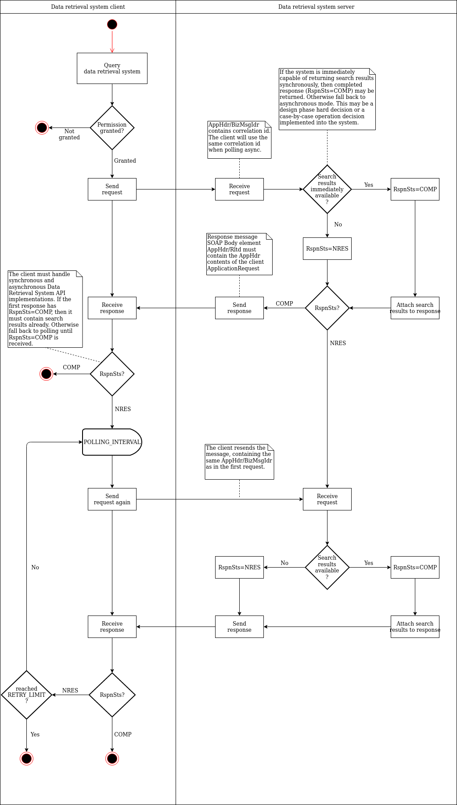

[Instruktioner för produktionssättning och underhåll av datasöksystemet](instructions/Instruktioner_för_produktionssättning_och_underhåll_av_datasöksystemet_SV.pdf)  

# Datasöksystemets frågegränssnitt

*Dokumentversion 1.0.45*

## Versionshistorik

Version|Datum|Beskrivning
---|---|---
1.0|21.10.2019|Version 1.0|
1.0.1|1.11.2019|Punkten Investigation Period (InvstgtnPrd, stycke 4.5) har uppdaterats.|
1.0.2|1.11.2019|WSDL tillsatt|
1.0.3|27.11.2019|Ccy-elementet har ändrats till ett obligatoriskt element|
1.0.4|27.11.2019|Anvisningar och scheman gällande anmälning av omtvistade uppgifter har lagts till.|
1.0.5|18.12.2019|Contract-element i undermeddelandet fin.013 har beskrivits. I punkt 4.2 har tabeller lagts till för att beskriva datainnehållet i registret över bank- och betalkonton meddelandespecifikt. Formatet i namnfältet PartyIdentification41 har fastställts. Villkoren för namnsökning har preciserats. I undermeddelandet fin.012 AdditionalSearchCriteria har felaktig kolumn Obligatorisk tagits bort. Hänvisningen till OTHER-tabellen i samband med frågeparametrar har tagits bort. Beskrivningen av Investigation period har preciserats. Ägare-kodens abstraktionsnivå har höjts. I Role OwnrTp har en felaktig hänvisning till Cd-elementet tagits bort. De uppgifter om juridiska personer som returneras har preciserats. Användningen av SdBoxAndParties har beskrivits.
1.0.6|21.1.2020|Användningen av ReturnIndicator1 har preciserats när inga sökresultat hittas för undermeddelandet.|
1.0.7|7.2.2020|Förnamn och efternamn har ersatts av fullständigt namn.|
1.0.8|7.2.2020|Kravet på att startdatumet för bankfackets hyrestid är obligatoriskt har slopats. |
1.0.9|19.2.2020|Innehållet i fältet fin013 Beneficiaries har ändrats till PersonIdentification5, eftersom bara fysiska personer är tillåtna.|
1.0.10|5.3.2020|Bekräftelse av att bankfacket kan användas som sökkriterium. Kraven gällande XML-signatur har uppdaterats. SchemeNm har ändrats till SchmeNm.|
1.0.11|5.3.2020|En beskrivning av laglighetsgrund har lagts till.|
1.0.12|10.3.2020|Beskrivningen av svarsmeddelandet har uppdaterats vad rollerna med anslutning till konton gäller.|
1.0.13|12.3.2020|Användningen av posterna vid sökning med IBAN- och andra kontoidentifieringsuppgifter har kompletterats.|
1.0.14|17.3.2020|Exemplet på XML-signatur har uppdaterats.|
1.0.15|17.3.2020|Innehållet i fältet fin013 Beneficiaries har ändrats tillbaka till PartyIdentification41. Contract-fältet har ändrats till ett valfritt fält.|
1.0.16|26.3.2020|Fin.013-schemat och dess användning har uppdaterats.|
1.0.17|26.3.2020|En beskrivning av sökningen med bankfackets identifieringsuppgift har lagts till. InformationRequestFIN012 har uppdaterats till versionen fin.012.001.02.|
1.0.18|26.3.2020|Användningen och kodningen av juridiska personers registreringsnummer har uppdaterats.|
1.0.19|31.3.2020|Terminologin har preciserats. En beskrivning av framställningssättet för långa kontoidentifierare har lagts till. En överflödig stycke har tagits bort. Certifikatens parter har preciserats. Signeringskraven har preciserats.|
1.0.20|17.4.2020|Start- och slutdatumet för rollen har lagts till i fältet InformationResponseFIN013 Beneficiary. InformationRequestFIN013 har uppdaterats till versionen fin.013.001.03.|
1.0.21|20.4.2020|Möjligheten att söka med legitimationens identifieringsnummer har slopats.|
1.0.22|24.4.2020|Beskrivningen av fältet SearchCriteria1Choice har uppdaterats i avsnitt 4.5.|
1.0.23|29.4.2020|Bilden 2.1 Förfrågan om bank- och betalkontouppgifter har förtydligats.  Felkoderna har numrerats.|
1.0.24|5.5.2020|Preciseringar i avsnitt 4.3: uppgift om en fysisk persons förmånstagare, uppgift om parterna i kontot, uppgift om parterna i facket.|
1.0.25|6.5.2020|Begränsningarna för angivande av för- och efternamn har förtydligats i ISO 20022 auth.001-meddelandet.|
1.0.26|7.5.2020|Länkarna i avsnitten 4.2 och 4.3 har korrigerats.|
1.0.27|11.5.2020|Kravet på obligatoriskt startdatum för rollen som förmånstagare har slopats, schemat fin.013 har uppdaterats till versionen fin.013.001.04.|
1.0.28|14.5.2020|Svarsmeddelandenas storleksbegränsningar har preciserats. |
1.0.29|28.5.2020|Unauthorized-felkod har lagts till i tabell 4.12.1.|
1.0.30|2.6.2020|Skrivfel och formuleringar har korrigerats. Onödiga punkter har strukits. I tabellen Användning av SdBoxRole har fel korrigerats.|
1.0.31|8.6.2020|fin.002.001.02.xsd och fin.012.001.02.xsd har uppdaterats.|
1.0.32|11.6.2020|Elementet InfRspnFin012 i schemat fin.012 har döpts om till InfReqFin012. Schemat fin.012 har uppdaterats till version fin.012.001.03.|
1.0.33|12.6.2020|Beskrivningen av XML-signatur har uppdaterats. WSDL har uppdaterats.|
1.0.34|3.7.2020|En precisering att sökkriterierna ”företagets namn” och ”namn för fysisk person” inte är skiftlägeskänsliga.|
1.0.35|23.7.2020|Länkarna till webbplatsen iso20022.org har uppdaterats.|
1.0.36|13.8.2020|Taggen för företagets namn har korrigerats (Id -> Nm) i tabellen ”Sökning med företagets namn”.|
1.0.37|24.8.2020|En preciserande anmärkning beträffande längderna på de nycklar som används i datakommunikation och i meddelandenas signaturer har lagts till.|
1.0.38|24.8.2020|Stycket ”Begränsning av undermeddelanden i sökresultatet” har lagts till. Ordet ”högst” har raderats i meningen ”för varje typ av sökresultat returneras ett undermeddelande med sökresultat”.|
1.0.39|25.8.2020|Både FO-nummer och momsnummer tillåts som attributet serialNumber i datakommunikations- och signeringscertifikatet.|
1.0.40|17.9.2020|Beriktiged meddelande fin.002.001.01 hänvisning till fin.002.001.02 version.|
1.0.41|18.9.2020|Tillagd svarsmeddelandestorlek är för stor fel i tabell 4.12.1.|
1.0.42|25.9.2020|Ersatt iso20022.org-länkar med referenser till lokala filer eftersom platsen för filer på iso20022.org ändras ofta.|
1.0.43|20.11.2020|Tillagd svarsmeddelandet innehåller flera träff fel i tabell 4.12.1.|
1.0.44|27.1.2021|Användningen av DtAndPlcOfBirth och DateOrDateTimePeriodChoice elementer har preciserats.|
1.0.45|pp.kk.2021|[SV]Poistettu tili-, tallelokero- ja edunsaajaroolien alku- ja loppupäivät. Päivitetty fin.013 skeema versioon fin.013.001.05 ja fin.002 skeema versioon fin.002.001.03. Korjattu virhe WSDL:ssä. ApplicationRequest- ja ApplicationResponse-elementtien sisältämät AppHdr- ja Document-elementit olivat virheellisesti wsdl_root-nimiavaruudessa.|

## Innehåll

1. [Inledning](#paragraf1)  
2. [Förfrågan om bank- och betalkontouppgifter i datasöksystemet](#paragraf2)  
3. [Dataskydd](#dataskydd)  
4. [Datasöksystemets frågegränssnitt](#fragegranssnitt)   
  4.1 [Meddelandestruktur för frågegränssnittets SOAP-operationer](#4-1)    
  4.2 [Business Application Header (BAH)](#4-2)    
  4.3 [Meddelanden i frågegränssnittet](#4-3)    
  4.4 [BusinessApplicationHeaderV01](#BusinessApplicationHeaderV01)    
  4.5 [InformationRequestOpeningV01](#InformationRequestOpeningV01)    
  4.6 [InformationRequestFIN012](#InformationRequestFIN012)    
  4.7 [InformationRequestResponseV01](#InformationRequestResponseV01)    
  4.8 [InformationResponseSD1V01](#InformationResponseSD1V01)    
  4.9 [InformationResponseFIN002](#InformationResponseFIN002)    
  4.10 [InformationResponseFIN013](#InformationResponseFIN013)   
  4.11 [Användning av id-element](#Anvandning_av_Id-element)    
  4.12 [Scenarier för frågegränssnittets WS-meddelandetrafik](#4-12)    
  4.13 [Returnering av omtvistade uppgifter](#4-13)  


## 1. Inledning <a name="paragraf1"></a>

### 1.1 Termer och förkortningar

Förkortning eller term|Förklaring
---|---
Gränssnitt|Standardenlig praxis eller kontaktyta som möjliggör överföring av information mellan enheter, programvara eller användare. 
WS (Web Service)|Webbaserat datorprogram som med hjälp av standardiserade internetprotokoll ställer tjänster till förfogande för applikationerna. Den tjänst som datasöksystemet tillhandahåller är förfrågan om uppgifter.
Endpoint|Gränssnittstjänst som finns tillgänglig på en viss webbadress.
WSDL| (Web Service Description Language) Strukturellt beskrivningsspråk som används för att beskriva funktioner som en webbtjänst erbjuder.

### 1.2 Dokumentets syfte och omfattning

Detta dokument ingår i Tullens föreskrift om ett övervakningssystem för bank- och betalkonton. Syftet med dokumentet är att ge anvisningar gällande datasöksystemets frågegränssnitt. Detta dokument kompletteras av Instruktioner för produktionssättning och underhåll av datasöksystemet.

### 1.3 Hänvisningar

[WSDL för datasöksystemet](wsdl/data-retrieval-system-wsdl.xml)

[ISO 20022 External Code Sets](assets/iso20022org/ExternalCodeSets_2Q2020_August2020_v1.xlsx)

[ISO 20022 auth.001.001.01 InformationRequestOpeningV01 MDR](assets/iso20022org/archive_business_area_authorities.zip)

[ISO 20022 auth.002.001.01 InformationRequestResponseV01 MDR](assets/iso20022org/archive_business_area_authorities.zip)

[ISO 20022 head.001.001.01 schema](assets/iso20022org/archive_business_area_business_application_header.zip)

[fin.002.001.03](schemas/fin.002.001.03.xsd)

[fin.012.001.03](schemas/fin.012.001.03.xsd)

[fin.013.001.05](schemas/fin.013.001.05.xsd)

[Anvisning om informationssäkerheten inom elektronisk ärendehantering på Finska](http://julkaisut.valtioneuvosto.fi/bitstream/handle/10024/80012/VM_25_2017.pdf)

### 1.4 Allmän beskrivning

Tullen har inrättat ett Kontoregisterprojekt för att genomföra direktivet (EU) 2018/843 och det övervakningssystem över bank- och betalkonton som grundar sig på Finlands lagstiftning och vars syfte är att genomföra direktivet.
 
I detta dokument beskrivs datasöksystemets frågegränssnitt.

## 2. Förfrågan om bank- och betalkontoppgifter i datasöksystemet  <a name="paragraf2"></a>

I detta kapitel beskrivs förfrågan om bank- och betalkontouppgifter i datasöksystemet.

Myndigheters system har begränsningar för storleken på enstaka meddelanden.

Aktörerna kan i samband med ibruktagandet komma överens om hur stora meddelandena får vara samt hur enstaka meddelandens storlek vid behov kan minskas eller hur sporadiska överstora meddelanden kan levereras.

På bild 2.1 visas förfrågan om bank- och betalkontouppgifter från datasöksystemet i form av ett flödesschema.

  
*__Bild 2.1.__ Förfrågan om bank- och betalkontouppgifter*  

Av bilden framgår att frågegränssnittet gör det möjligt att returnera svar genast synkront eller alternativt asynkront.

I tabell 2.1 visas betydelsen av flödesschemats parametrar.

*__Tabell 2.1.__ Flödesschemats parametrar*

|Parameter|Beskrivning|
|:--|:--|
|POLLING_INTERVAL|Pollingintervall, ett tidsintervall som klienten måste vänta innan följande förfrågning. Om klienten pollar servern för frekvent, kan servern avvisa behandlingen av transaktionen (felkod 3, se [4.12](#4-12)).|
|RETRY_LIMIT|Högsta tillåtna antal pollingar innan upphörande. Om något svar fortfarande inte fås, ska en helt ny förfrågan göras eller ärendet flyttas till manuell handläggning.|

Värdena för gällande parameter som anges i tabell 2.1 anges i den bifogade dokumentationen.

Förfrågningen har följande flöde:
1.	Klienten skickar ett frågemeddelande
2.	Servern kan beroende på kapacitet och kontext returnera sökresultatet antingen synkront eller asynkront. Servern antingen
a. returnerar svarsmeddelandet som innehåller sökresultatet och koden COMP till exempel inom fem (5) sekunder, eller
b. returnerar svarsmeddelandet som innehåller koden NRES
3.	Klienten kontrollerar om svarsmeddelandet innehåller koden COMP eller NRES
4.	Om koden är COMP, gå till punkt 10.
5.	Koden är NRES. Klienten väntar den tid som fastställts enligt parametern POLLING_INTERVAL och gör därpå förfrågan request #2
6.	Servern antingen
a. returnerar sökresultatet och koden COMP eller
b. returnerar svarsmeddelandet som innehåller koden NRES
7.	Klienten kontrollerar om svarsmeddelandet innehåller koden COMP eller NRES
8.	Om koden är COMP, gå till punkt 10.
9.	Koden är NRES. Om gränsen RETRY_LIMIT inte uppnåtts, gå till punkt 5.
10.	Slut.
 
I tabell 2.2 beskrivs användningen av värdena för StatusResponse1Code.

*__Tabell 2.2.__ Användning av värden för StatusResponse1Code*

|Kod|Namn|Definition|Beskrivning|
|:--|:--|:--|:--|
|COMP|CompleteResponse|Response is complete.|Svarsmeddelandet innehåller sökresultaten.|
|NRES|NoResponseYet|Response not provided yet.|Svarsmeddelandet innehåller inte några sökresultat, gör en ny förfrågan senare.|
|PART|PartialResponse|Response is partially provided.|Används inte.|

## <a name="dataskydd"></a> 3. Dataskydd
  
### 3.1 Identifiering

I tabell 3.1 presenteras de certifikat som används i datasöksystemet.

*__Tabell 3.1.__ Datasöksystemets certifikat*

|Standard|Certifikatets namn|Användningssyfte|
|:--|:--|:--|
|X.509 (version 3)|Datasöksystemets datakommunikationscertifikat|Identifiering av den som använder gränssnittet och uppgiftslämnaren eller en aktör som befullmäktigats av uppgiftslämnaren.|
|X.509 (version 3)|Datasöksystemets signeringscertifikat|Signerande av meddelandet, säkerställande av meddelandets integritet, identifiering av uppgiftslämnaren.|

De som använder datasöksystemets frågegränssnitt samt uppgiftslämnare eller aktörer som befullmäktigats av uppgiftslämnaren identifieras med X.509-certifikat (Datakommunikationscertifikat). Frågegränssnittets fråge- och svarsmeddelanden signeras med en XML-signatur (Signeringscertifikat).

#### Uppgiftslämnarens signeringscertifikat

Uppgiftslämnaren ska signera sina meddelanden med x.509-servercertifikat av vilket framgår uppgiftslämnarens FO-nummer eller momsnummer. Inkommande meddelandens signatur ska kontrolleras. Mottagaren får inte godkänna meddelanden utan godtagbar signatur. Godkännandet av signaturen förutsätter att XML-signaturen är giltig och 

antingen

a) att certifikatet har utfärdats av BRC, är i kraft och inte finns på BRC:s spärrlista och att attributet serialNumber för objektet för certifikatet är FO-numret eller momsnumret för uppgiftslämnaren

eller

b) att certifikatet är ett identifieringscertifikat för eIDAS-godkända webbplatser, är i kraft och inte finns på certifikatutfärdarens uppdaterade spärrlista och att attributet organizationIdentifier för objektet för certifikatet är FO-numret eller momsnumret för uppgiftslämnaren.

Obs. För att meddelandenas signaturer ska uppfylla de datasäkerhetskrav från Cybersäkerhetscentret som det hänvisas till nedan ska den publika nyckeln (RSA public key) för certifikatet som används för signaturer ha minst 3072 bitar. Användningssyftena för ett certifikat som används för signaturer ska också omfatta ”digital signatur”. Man ska beakta dessa omständigheter när man beställer ett certifikat.

#### Behörig myndighets signeringscertifikat

Behöriga myndigheter ska signera sina meddelanden med x.509-servercertifikat av vilket framgår myndighetens FO-nummer. Inkommande meddelandens signatur ska kontrolleras. Mottagaren får inte godkänna meddelanden utan godtagbar signatur. Godkännandet av behöriga myndigheters signatur förutsätter att XML-signaturen är giltig och att

a)	certifikatet har utfärdats av BRC, är i kraft och inte finns på BRC:s spärrlista

b)	objektet för certifikatet har som serialNumber-attribut FO-numret för den behöriga myndighet som skickat meddelandet, eller det nummer som bildas av bokstäverna ”FI” och sifferdelen i myndighetens FO-nummer utan bindestreck (identifikation med momsnummerformat).


#### Datakommunikationscertifikat för den som tar kontakt

Uppgiftslämnaren eller den som uppgiftslämnaren befullmäktigat identifierar med hjälp av servercertifikatet den behöriga myndighet som tar kontakt med datasöksystemets frågegränssnitt. Kontakten från den behöriga myndigheten ska godkännas under följande förutsättningar:

a)	Certifikatet för den behöriga myndigheten har utfärdats av BRC.

b)	Certifikatet är i kraft och finns inte på BRC:s spärrlista.

c)	objektet för certifikatet har som serialNumber-attribut FO-numret för den behöriga myndigheten eller den statliga servicecentral som agerar på myndighetens vägnar, eller det nummer som bildas av bokstäverna ”FI” och sifferdelen i myndighetens eller servicecentralens FO-nummer utan bindestreck (identifikation med momsnummerformat).


#### Datakommunikationscertifikat för uppgiftslämnaren eller en aktör som befullmäktigats av uppgiftslämnaren

Den behöriga myndighet som tar kontakt med frågegränssnittet identifierar med hjälp av servercertifikatet uppgiftslämnaren eller den som uppgiftslämnaren befullmäktigat. Med en aktör som befullmäktigats av uppgiftslämnaren avses exempelvis en servicecentral som uppgiftslämnaren har befullmäktigat att upprätta och/eller skicka anmälningar.

Kontakten till uppgiftslämnaren ska godkännas under följande förutsättningar:

antingen

a) att servercertifikatet har utfärdats av BRC, är i kraft och inte finns på BRC:s spärrlista och att attributet serialNumber för objektet för certifikatet är FO-numret eller momsnumret för uppgiftslämnaren eller en aktör som befullmäktigats av denne

eller

b) att servercertifikatet är ett identifieringscertifikat för eIDAS-godkända webbplatser, är i kraft och inte finns på certifikatutfärdarens uppdaterade spärrlista och att attributet organizationIdentifier för objektet för certifikatet är FO-numret eller momsnumret för uppgiftslämnaren eller en aktör som befullmäktigats av denne.

Om datakommunikationscertifikatet för uppgiftslämnaren och signeringscertifikatet för det utgående meddelanden har samma FO-nummer eller momsnummer, kan samma certifikat användas för båda ändamålen.

Obs. För att skydd av datakommunikation ska uppfylla de datasäkerhetskrav från Cybersäkerhetscentret som det hänvisas till nedan ska den publika nyckeln (RSA public key) för certifikatet som används ha minst 3072 bitar. Man ska beakta detta när man beställer ett certifikat.

#### <a name="xml-sig"></a> Bildande av XML-signatur

Signaturens typ är __enveloped signature__. Signature-elementet placeras i [BAH](#BusinessApplicationHeaderV01) under Sgntr-elementet.

Exempel 3.1 Exempel SignedInfo
```
<SignedInfo>
  <CanonicalizationMethod Algorithm="http://www.w3.org/2001/10/xml-exc-c14n#" />
  <SignatureMethod Algorithm="http://www.w3.org/2001/04/xmldsig-more#rsa-sha256" />
  <Reference URI="#applicationRequest">
    <Transforms>
      <Transform Algorithm="http://www.w3.org/2000/09/xmldsig#enveloped-signature" />
      <Transform Algorithm="http://www.w3.org/2001/10/xml-exc-c14n#" />
    </Transforms>
    <DigestMethod Algorithm="http://www.w3.org/2001/04/xmlenc#sha256" />
    <DigestValue />
  </Reference>
</SignedInfo>
```

Signeringsalgoritmen är således RSA-SHA256 och C14N är Exclusive XML Canonicalization. Reference URI är antingen “#applicationRequest” eller “#applicationResponse”, beroende på  om det är ett fråge- eller svarsmeddelande. Bara “ApplicationRequest”- eller “ApplicationResponse”-elementet signeras. Då signaturen bildas ska man för bildandet av de kondensat som ska beräknas (Digest) använda algoritmen SHA256.

De kryptografiska algoritmer som används i signaturen ska till sin kryptografiska styrka motsvara minst Kommunikationsverkets krav på kryptografisk styrka för den nationella skyddsnivån ST IV. De nuvarande kraven gällande styrkan beskrivs på finska i dokumentet https://www.kyberturvallisuuskeskus.fi/sites/default/files/media/regulation/ohje-kryptografiset-vahvuusvaatimukset-kansalliset-suojaustasot.pdf (Dnro: 190/651/2015).

Möjligheten att begränsa IP-rymden för förfrågningar i datasöksystemet preciseras senare.

### 3.2 Skydd för förbindelser

Förbindelserna i Datasöksystemets frågegränssnitt ska skyddas med TLS-kryptering med TLS-protokollets version 1.2 eller högre. Båda ändarna av förbindelsen identifieras med servercertifikatet som beskrivs ovan genom ömsesidig TLS-autentisering. Förbindelsen ska bildas med hjälp av ett ephemeral Diffie-Hellman (DHE) nyckelbyte där det för varje session skapas en ny unik privat krypteringsnyckel. Syftet med detta förfarande är att säkerställa krypteringens forward secrecy-egenskap så att ett röjande av krypteringsnyckeln inte leder till att den krypterade informationen röjs.

De kryptografiska algoritmer som används vid TLS-kryptering ska ha minst samma kryptografiska styrka som de kryptografiska styrkekrav som Kommunikationsverket fastställt för den nationella krypteringsnivån ST IV. Nuvarande styrkekrav beskrivs på finska i dokumentet https://www.kyberturvallisuuskeskus.fi/sites/default/files/media/regulation/ohje-kryptografiset-vahvuusvaatimukset-kansalliset-suojaustasot.pdf (Dnro: 190/651/2015).

### 3.3 Tillåten HTTP-version

De förbindelser som används av datasöksystemets frågegränssnitt använder version 1.1 av HTTP-protokollet.

### 3.4 Skyldighet att anmäla informationssäkerhetsincidenter

Om certifikaten eller deras krypterade nycklar för den som genomför datasöksystemet äventyras ska detta anmälas omedelbart till den som utfärdat certifikatet och de behöriga myndigheter som använder datasöksystemet. De behöriga myndigheterna ska även underrättas om man upptäcker informationssäkerhetsincidenter i datasöksystemet.

Om certifikatet eller deras krypterade nycklar för en behörig myndighet som använder datasöksystemet äventyras ska detta anmälas omedelbart till den som utfärdat certifikatet och de genomförare av datasöksystemet som genomför det datasöksystem som den behöriga myndigheten i fråga använder.

## <a name="fragegranssnitt"></a> 4. Datasöksystemets frågegränssnitt

Frågegränssnittet implementeras med SOAP/XML Web Service, för vilken [WSDL](wsdl/data-retrieval-system-wsdl.xml) publiceras.

Version 1.1 av SOAP-protokollet används.

I meddelandena används hänvisningar till koduppsättningen i ISO 20022-standarden. Hänvisningarna till koduppsättningen finns på ISO 20022-sidan [External Code Sets](assets/iso20022org/ExternalCodeSets_2Q2020_August2020_v1.xlsx).

I frågegränssnittet finns en endpoint, vars fråge- och svarsmeddelandestruktur beskrivs i detta kapitel.

### <a name="4-1"></a> 4.1 Meddelandestruktur för frågegränssnittets SOAP-operationer

SOAP body består alltid av två delar, ISO 20022 Business Application Header (BAH) och det egentliga business-meddelandet.

### <a name="4-2"></a> 4.2 Business Application Header (BAH) 

Business Application Header-meddelandets uppgifter visas i tabellen nedan.

|Meddelande-id|Meddelandets namn|
|:---|:---|
|[head.001.001.01](assets/iso20022org/archive_business_application_header_2.zip)|Business Application Header|

BAH ska alltid vara det första elementet i SOAP body.

### <a name="4-3"></a> 4.3 Meddelanden i frågegränssnittet

I datasöksystemets frågegränssnitt används ISO 20022 -meddelandena [InformationRequestOpeningV01 (auth.001.001.01)](assets/iso20022org/auth.001.001.01.xsd) och [InformationRequestResponseV01 (auth.002.001.01)](assets/iso20022org/auth.002.001.01.xsd) till vilka behövliga undermeddelanden ([Supplementary Data](assets/iso20022org/InformationResponse_SupplementaryData.zip)) kopplas.

Undermeddelanden som används på högre nivå delas in i tre begrepp: kundrelation, konto och bankfack. Uppgifterna om kundrelation och förmånstagare returneras i meddelandet [fin.013.001.05](schemas/fin.013.001.05.xsd), kontouppgifterna i meddelandet [supl.027.001.01](assets/iso20022org/InformationResponse_SupplementaryData.zip) och bankfacksuppgifterna i meddelandet [fin.002.001.03](schemas/fin.002.001.03.xsd) (Obs. samma kod som vid manuell behandling i vissa befintliga system). Dessa undermeddelanden kopplas till [auth.002.001.01](assets/iso20022org/auth.002.001.01.xsd)-elementet `InformationRequestResponseV01/RtrInd`.

I tabellerna *4.3.1*–*4.3.5* presenteras datainnehållet i registret över bank- och betalkonton, samt Supplementary Data-undermeddelandet, i vilken varje uppgift returneras.

I tabellerna *4.3.6*–*4.3.8* presenteras auth-meddelandena enligt  ISO 20022-standarden samt de undermeddelanden som kopplas till dem.

Närmare meddelandebeskrivningar finns i detta kapitel fr.o.m. punkt 4.4 nedan.

*__Tabell 4.3.1:__ Fysisk person, uppgifterna per meddelande*
		
|Uppgift|Meddelande(n)|Beskrivning|
|:---|:---|:---|
|Fullständigt namn|fin.002, fin.013, supl.027|Returneras i Pty/Nm-elementet som kopplats till rollen, i samma format som i källsystemet. För att åstadkomma kompatibilitet med befintliga system ska ett enda namnfält användas för att ange personens samtliga namn. Detta elements format i fråga om för- och efternamn är inte exakt bestämt i ISO 20022-meddelandeimplementeringar, som använts som underlag i specifikationsarbetet för datasökgränssnittet  (auth.001: Document/InfReqOpng/SchCrit/CstmrId/Pty/Nm). Därtill ska det beaktas att alla personer inte har för- och efternamn globalt sett.|
|Födelsedatum|fin.002, fin.013, supl.027|Returneras, om den fysiska personen inte har finländsk personbeteckning. Returneras som en del av Id-elementet som kopplats till rollen, se [Användning av Id-element](#Anvandning_av_Id-element)|
|Personbeteckning|fin.002, fin.013, supl.027|Returneras som en del av Id-elementet som kopplats till rollen, se [Användning av Id-element](#Anvandning_av_Id-element)|
|Medborgarskap|fin.002, fin.013, supl.027|Returneras, om den fysiska personen inte har finländsk personbeteckning. Returneras som en del av Id-elementet som kopplats till rollen, se [Användning av Id-element](#Anvandning_av_Id-element)|
|Förmånstagare|fin.013|Organisationer där förmånstagaren är den här fysisk person.|
|Omtvistad|auth.002|Supplementary Data enligt [disputed-schemat](schemas/disputed.xsd)|

*__Tabell 4.3.2:__ Juridisk person, uppgifterna per meddelande*

|Uppgift|Meddelande(n)|Beskrivning|
|:---|:---|:---|
|Namn|fin.002, fin.013, supl.027|Returneras i Pty/Nm-elementet som kopplats till rollen.|
|Registreringsnummer|fin.002, fin.013, supl.027|Returneras som en del av Id-elementet som kopplats till rollen, se [Användning av Id-element](#Anvandning_av_Id-element)|
|Registreringsmyndighet|fin.002, fin.013, supl.027|Returneras som en del av Id-elementet som kopplats till rollen, se [Användning av Id-element](#Anvandning_av_Id-element)|
|Registreringsdag|fin.002, fin.013, supl.027|Returneras som en del av Id-elementet som kopplats till rollen, se [Användning av Id-element](#Anvandning_av_Id-element)|
|Aktörens identifieringsuppgift|fin.002, fin.013, supl.027|Returneras som en del av Id-elementet som kopplats till rollen, se [Användning av Id-element](#Anvandning_av_Id-element)|
|Omtvistad|auth.002|Supplementary Data enligt [disputed-schemat](schemas/disputed.xsd)|

*__Tabell 4.3.3:__ Bank- och betalkonto, uppgifterna per meddelande*

|Uppgift|Meddelande(n)|Beskrivning|
|:---|:---|:---|
|IBAN-nummer|supl.027|Se [Användning av CustomerAccount](#CustomerAccount1)|
|Datum då kontot öppnats|supl.027|Returneras i AddtlInf-fältet|
|Datum då kontot stängts|supl.027|Se [Användning av CustomerAccount](#CustomerAccount1)|
|Parterna i kontot|supl.027|Kontoinnehavare och de som har dispositionsrätt till kontot.|
|Omtvistad|auth.002|Supplementary Data enligt [disputed-schemat](schemas/disputed.xsd)|

*__Tabell 4.3.4:__ TallBankfack, uppgifterna per meddelande*

|Uppgift|Meddelande(n)|Beskrivning|
|:---|:---|:---|
|Identifieringsuppgift|fin.002|Se [Användning av SafetyDepositBoxAndParties](#SafetyDepositBoxAndParties)|
|Startdatum för hyrestid|fin.002|Se [Användning av SafetyDepositBoxAndParties](#SafetyDepositBoxAndParties)|
|Slutdatum för hyrestid|fin.002|Se [Användning av SafetyDepositBoxAndParties](#SafetyDepositBoxAndParties)|
|Parterna i bankfacket|fin.002|Innehavare av bankfacket och de som har dispositionsrätt till bankfacket.|
|Omtvistad|auth.002|Supplementary Data enligt [disputed-schemat](schemas/disputed.xsd)|

*__Tabell 4.3.5:__ Kundrelation, uppgifterna per meddelande*

|Uppgift|Meddelande(n)|Beskrivning|
|:---|:---|:---|
|Kundrelation|fin.013|Se [InformationResponseFIN013](#InformationResponseFIN013)|
|Startdatum|fin.013|Se [InformationResponseFIN013](#InformationResponseFIN013)|
|Slutdatum|fin.013|Se [InformationResponseFIN013](#InformationResponseFIN013)|
|Omtvistad|auth.002|Supplementary Data enligt [disputed-schemat](schemas/disputed.xsd)|


*__Tabell 4.3.6:__ Auth-meddelanden enligt ISO 20022-standarden*

|Meddelande-id|Meddelandets namn|Användningssyfte|Ansvarig organisation|Msg Def Report|
|---|---|---|---|---| 
|auth.001.001.01|InformationRequestOpeningV01|Frågemeddelande i frågegränssnittet|FFI|[MDR](assets/iso20022org/archive_business_area_authorities.zip)|
|auth.002.001.01|InformationRequestResponseV01|Svarsmeddelande i frågegränssnittet|FFI|[MDR](assets/iso20022org/archive_business_area_authorities.zip)|


*__Tabell 4.3.7:__ Undermeddelande som kopplas till frågemeddelandet auth.001*

|Meddelande-id|Meddelandets namn|Meddelande-id för utvidgat ISO 20022-meddelande|Syfte och funktion|
|---|---|---|---|
|FIN012|InformationRequestFIN012|auth.001.001.01|Utvidgat ISO 20022-meddelande. Myndigheter som har behörighet att använda frågegränssnittet använder detta meddelande för förfrågan om uppgifter från datasöksystemet. Innehåller koder för den person som gör förfrågan och dennes chef. Gör det möjligt att använda sökkriterier som saknas i auth.001.001.01 (t.ex. bankfack)|

*__Tabell 4.3.8:__ Undermeddelande som kopplas till svarsmeddelandet auth.002*

|Meddelande-id|Meddelandets namn|Meddelande-id för utvidgat ISO 20022-meddelande|Syfte och funktion|
|---|---|---|---|
|supl.027.001.01|InformationResponseSD1V01|auth.002.001.01|Innehåller kontouppgifter som motsvarar sökparametrarna.|
|FIN002|InformationResponseFIN002|auth.002.001.01|Innehåller uppgifter om bankfack som motsvarar sökparametrarna.|
|FIN013|InformationResponseFIN013|auth.002.001.01|Innehåller kundrelationsuppgifter som motsvarar sökparametrarna, separat från uppgifterna om konton och bankfack.|

I frågegränssnittets svarsmeddelanden inkluderas alla sådana uppgifter som motsvarar sökkriterierna och vars utsträckning i tiden härleds från 3 kap. 3 § i lagen om förhindrande av penningtvätt och av finansiering av terrorism där det på ett exakt och väl avgränsat sätt föreskrivs om uppgifterna om kundkontroll och bevarande av uppgifterna. Alla delaktighetsuppgifter i anslutning till konton och bankfack returneras, det vill säga förutom personer (juridiska eller fysiska) som uppfyller sökvillkoret som angetts som frågeparameter returneras också alla berörda personer. Däremot returneras inte de berörda personernas konton eller bankfack som inte motsvarar sökparametern, utan i fråga om dem måste en ny förfrågan som grundar sig på lagstiftningen göras.

### <a name="BusinessApplicationHeaderV01"></a> 4.4 BusinessApplicationHeaderV01

I tabellen nedan visas användningen av BAH-element. Elementtyperna beskrivs i [head.001.001.01-schemat](assets/iso20022org/archive_business_area_business_application_header.zip).

|Namn|Typ|Används|Beskrivning|
|:---|:---|:---|:---|
|BusinessApplicationHeaderV01| | | |
|CharSet|UnicodeChartsCode|Ja|"UTF-8"|
|Fr|Party9Choice|Ja|Används på följande sätt:  Elementet `Fr/OrgId/Id/OrgId/Othr/SchmeNm/Cd` innehåller värdet ”Y” och elementet `Fr/OrgId/Id/OrgId/Othr/Id` innehåller avsändarens FO-nummer.|
|To|Party9Choice|Ja|Används på följande sätt:  Elementet `To/OrgId/Id/OrgId/Othr/SchmeNm/Cd` innehåller värdet ”Y” och elementet `To/OrgId/Id/OrgId/Othr/Id` innehåller mottagarens FO-nummer (t.ex. i datasöksystemet FO-nummer 0245442-8)|
|BizMsgIdr|Max35Text|Ja|Används enligt standarden.|
|MsgDefIdr|Max35Text|Ja|Innehåller meddelande-id. I frågemeddelandet används ”auth.001.001.01”, medan ”auth.002.001.01” används i svarsmeddelandet.|
|BizSvc||Nej||
|CreDt|ISONormalisedDateTime|Ja|Datum och tid då BAH skapades. Normaliseras med Z-notation (UTC).|
|CpyDplct||Nej| |
|PssblDplct| |Nej| |
|Prty| |Nej| |
|Sgntr| |Ja|XML-signatur som bildas av avsändare av Business message. Se [Bildande av XML-signatur](#xml-sig)|
|Rltd|BusinessApplicationHeader1|Ja|Används i svarsmeddelande, innehåller frågemeddelandets BAH.|

### <a name="InformationRequestOpeningV01"></a> 4.5 InformationRequestOpeningV01

I tabellen beskrivs användningen av meddelandets poster.

|Namn|Typ|Används|Beskrivning|
|:---|:---|:---|:---|
|InformationRequestOpeningV01| | | |
|&nbsp;&nbsp;&nbsp;&nbsp;InvstgtnId|Max35Text|Ja|Case id för undersökningen.|
|&nbsp;&nbsp;&nbsp;&nbsp;LglMndtBsis|LegalMandate1|Ja|Laglighetsgrund. Ett numeriskt värde mellan 100..n. De första siffrorna anger myndigheten och de två sista laglighetsgrunden. Laglighetsgrunderna samlas  i myndigheternas gemensamma kodtabell så som överenskommits med Finance Finland. Tabellen ges i samband med avtalsförhandlingarna till dem som bygger upp datasöksystem (tabellen är inte offentlig).|
|&nbsp;&nbsp;&nbsp;&nbsp;CnfdtltySts|YesNoIndicator|Ja|Alltid "true"|
|&nbsp;&nbsp;&nbsp;&nbsp;DueDt|DueDate1|Nej||
|&nbsp;&nbsp;&nbsp;&nbsp;InvstgtnPrd|DateOrDateTimePeriodChoice|Ja|Datum eller datumintervall som sökningen riktar sig till. Datumintervallet är alltid i dag eller i det förflutna. Sökning med tidsintervall ska göras så att om tidsintervallet för någon uppgift (alla datumposter i tabellerna 4.3.1–4.3.5) ingår delvis eller helt i det angivna InvstgtnPrd-tidsintervallet, ska uppgiftsraden i fråga läggas till i sökresultatet. Endast Dt-elementet används.|
|&nbsp;&nbsp;&nbsp;&nbsp;SchCrit|SearchCriteria1Choice|Ja|Sökkriterium. Ett så exakt sökkriterium som möjligt ska alltid användas. Se [närmare specificering](#SearchCriteria1Choice) nedan.|
|&nbsp;&nbsp;&nbsp;&nbsp;SplmtryData|SupplementaryData1|Ja|Innehåller det utvidgade meddelandet [InformationRequestFIN012](#InformationRequestFIN012).|

#### <a name="SearchCriteria1Choice"></a> Begränsning av undermeddelanden i sökresultatet

Systemet returnerar endast de undermeddelanden som begärs i sökkriterierna (supl.027.001.01, fin.002.001.03, fin.013.001.05). Varje undermeddelande begärs i ett separat element av typen AuthorityRequestType1, som det alltså ska finnas 1–3 av i sökkriterierna.

|Tagg|Schemats sökväg InfReqOpng/SchCrit/|Beskrivning|Regel|
|:---|:---|:---|:---|
|\<MsgNmId\>|Sökning med personbeteckning, med kombinationen naturlig persons namn, medborgarskap och födelsedatum, med juridisk persons registreringsnummer, med företagets namn eller med bankfackets identifieringsuppgift:<br/>CstmrId/AuthrtyReq/Tp<br/><br/>Sökning med IBAN eller annan kontospecifikation:<br/>Acct/AuthrtyReqTp|"supl.027.001.01", "fin.002.001.03" eller "fin.013.001.05"||

#### <a name=""></a> Sökning med personbeteckning

|Tagg|Schemats sökväg InfReqOpng/SchCrit/|Beskrivning|Regel|
|:---|:---|:---|:---|
|\<Id\>|CstmrId/Pty/Id/PrvtId/Othr|Personbeteckning|Giftig personbeteckning.|
|\<Cd\>|CstmrId/Pty/Id/PrvtId/Othr/SchmeNm|"PIC" (Person Identification Code, personbeteckning)|
|\<Cd\>|CstmrId/AuthrtyReq/InvstgtdRoles|"ALLP"|

#### <a name=""></a> Sökning med juridiska personers registreringsnummer

|Tagg|Schemats sökväg InfReqOpng/SchCrit/|Beskrivning|Regel|
|:---|:---|:---|:---|
|\<Id\>|CstmrId/Pty/Id/OrgId/Othr|FO-nummer eller annat identifieringsnummer för juridiska personer || |
|\<Cd\>|CstmrId/Pty/Id/OrgId/Othr/SchmeNm|"COID"| |
|\<Cd\>|CstmrId/AuthrtyReq/InvstgtdRoles|"ALLP"| |


#### <a name=""></a> Sökning med företagets namn

|Tagg|Schemats sökväg InfReqOpng/SchCrit/|Beskrivning|Regel|
|:---|:---|:---|:---|
|\<Nm\>|CstmrId/Pty|Företags namn|Exakt träff 1:1. Inte skiftläges-känsligt|
|\<Id\>|CstmrId/Pty/Id/OrgId/Othr|Värdet ”1” ställs in|
|\<Cd\>|CstmrId/Pty/Id/OrgId/Othr/SchmeNm|"NAME"|
|\<Cd\>|CstmrId/AuthrtyReq/InvstgtdRoles|"ALLP"|


#### <a name=""></a> Sökning med IBAN

|Tagg|Schemats sökväg InfReqOpng/SchCrit/|Beskrivning|
|:---|:---|:---|
|\<IBAN\>|Acct/Id/Id|IBAN|
|\<Cd\>|Acct/InvstgtdPties|"ALLP"|

#### <a name=""></a> Sökning med en annan kontospecifikation

|Tagg|Schemats sökväg InfReqOpng/SchCrit/|Beskrivning|
|:---|:---|:---|
|\<Id\>|Acct/Id/Id/Othr|Annan kontospecifikation|
|\<Cd\>|Acct/Id/Id/Othr/SchmeNm|OTHR|
|\<Cd\>|Acct/InvstgtdPties|"ALLP"|

#### <a name=""></a> Sökning med kombinationen av namn, medborgarskap och födelsedatum för fysisk person

|Tagg|Schemats sökväg InfReqOpng/SchCrit/|Beskrivning|Regel|
|:---|:---|:---|:---|
|\<Nm\>|CstmrId/Pty|Nimi|Exakt träff 1:1 inkl. specialtecken. Inte skiftlägeskänsligt  Formatet är fritt.|
|\<Id\>|CstmrId/Pty/Id/PrvtId/Othr|Landskod|
|\<Cd\>|CstmrId/Pty/Id/PrvtId/Othr/SchmeNm|"NATI"|
|\<BirthDt\>|CstmrId/Pty/Id/PrvtId/DtAndPlcOfBirth|Födelsedatum. `CtryOfBirth` ges värdet "XX" och `CityOfBirth` ges värdet ”not in use”|
|\<Cd\>|CstmrId/AuthrtyReq/InvstgtdRoles|"ALLP"|

#### <a name=""></a> Sökning med bankfackets identifieringsuppgift

På grund av begränsningarna gällande ISO-meddelanden ska Document/InfReqOpng/SchCrit fyllas i med någon uppgift. CstmrId ska fyllas i:

|Tagg|Schemats sökväg InfReqOpng/SchCrit/|Beskrivning|
|:---|:---|:---|
|\<Pty\>|CstmrId|Lämnas tomt|
|\<Cd\>|CstmrId/AuthrtyReq/InvstgtdRoles|"ALLP"|

Det egentliga sökkriteriet, dvs. bankfackets identifieringsuppgift, anges i SafetyDepositBoxId-elementet i det utvidgade meddelandet fin.012.001.03 som i sin tur anges i Supplementary Data i auth.001.001.01-meddelandet på så sätt som anges i tabellen nedan. 

|Tagg|Schemats sökväg InfReqOpng/SplmtryData/Envlp/|Beskrivning|Regel|
|:---|:---|:---|:---|
|\<SafetyDepositBoxId\>|Document/InfReqFin012/AdditionalSearchCriteria/|Bankfackets identifierings-uppgift|Exakt träff 1:1 inkl. specialtecken. Formatet är fritt.|

### <a name="InformationRequestFIN012"></a> 4.6 Utvidgat meddelande InformationRequestFIN012

Det utvidgade meddelandet kopplas till ISO 20022-meddelandets XPath-läge som anges i tabellen.

|Namn|[min..max]|Typ|Beskrivning|Kopplas till meddelandet|XPath|
|:---|:---|:---|:---|:---|:---|
|InformationRequestFIN012| | | |[auth.001](#InformationRequestOpeningV01)|`/Document/InfReqOpng/SplmtryData/Envlp`|
|&nbsp;&nbsp;&nbsp;&nbsp;AuthorityInquiry|[1..1]|[AuthorityInquirySet](#AuthorityInquirySet)|Myndighets-uppgifter i anknytning till förfrågan.| |
|&nbsp;&nbsp;&nbsp;&nbsp;AdditionalSearchCriteria|[0..*]||Används för att söka med bankfackets identifierings-uppgift.||

#### <a name="AuthorityInquirySet"></a> AuthorityInquirySet

|Namn|[min..max]|Typ|Beskrivning|
|:---|:---|:---|:---|
|AuthorityInquirySet| | | |
|&nbsp;&nbsp;&nbsp;&nbsp;OfficialId|[0..1]|Max140Text|Myndighetens (person)kod|
|&nbsp;&nbsp;&nbsp;&nbsp;OfficialSuperiorId|[0..1]|Max140Text|Chefens kod|

### <a name="InformationRequestResponseV01"></a> 4.7 InformationRequestResponseV01

I tabellen beskrivs användningen av meddelandets poster.

|Namn|Typ|Används|[min..max]|Beskrivning|
|:---|:---|:---|:---|:---|
|InformationRequestResponseV01| | | | |
|&nbsp;&nbsp;&nbsp;&nbsp;RspnId|Max35Text|Ja|[1..1]|Svarsmeddelandets  id|
|&nbsp;&nbsp;&nbsp;&nbsp;InvstgtnId|Max35Text|Ja|[1..1]|Case Id som skickats i frågemeddelandet.|
|&nbsp;&nbsp;&nbsp;&nbsp;RspnSts|StatusResponse1Code|Ja|[1..1]|Svarsmeddelandets status, ”COMP”|
|&nbsp;&nbsp;&nbsp;&nbsp;SchCrit|SearchCriteria1Choice|Ja|[1..1]|I frågemeddelandet har Document/InfReqOpng/SchCrit förekommit som sådan|
|&nbsp;&nbsp;&nbsp;&nbsp;RtrInd|ReturnIndicator1|Ja|[0..*]| Se användning av ReturnIndicator1 nedan.|
|&nbsp;&nbsp;&nbsp;&nbsp;SplmtryData|SupplementaryData1|Ja|[0..1]|Se [Returnering av omtvistade uppgifter](#4-13)|

#### Användning av ReturnIndicator1

ReturnIndicator1 innehåller en enskild typ av sökresultat.

|XPath|Typ|Beskrivning|
|:---|:---|:---|
|RtrInd/AuthrtyReqTp/MsgNmId|Max35Text|Innehåller det utvidgade meddelandets meddelande-id (supl.027.001.01, fin.013.001.05 eller fin.002.001.01).|
|RtrInd/InvstgtnRslt|InvestigationResult1Choice|Returneras `Rslt`-elementet av typen SupplementaryDataEnvelope1, som innehåller antingen [supl.027.001.01](#InformationResponseSD1V01), [InformationResponseFIN002](#InformationResponseFIN002) eller [InformationResponseFIN013](#InformationResponseFIN013) eller `InvstgtnSts` med koden `NFOU`.

För varje typ av sökresultat returneras ett undermeddelande med sökresultat (supl.027.001.01, fin.013.001.05 eller fin.002.001.03) per FO-nummer.

__Exempel 1.__  

Det fanns tre resultat som motsvarande söktermen `Document/InfReqOpng/SchCrit` i frågemeddelandet: en kundrelation och två konton. Inga bankfack hittades.

Till svarsmeddelandet kopplas tre `RtrInd`-element. I fråga om två av dessa, supl.027.001.01 och fin.013.001.05, kopplas sökresultaten till Rslt-element och i fråga om fin.002.001.03 returneras `InvstgtnSts` med koden `NFOU`:

```
<!-- xmlns:n1="urn:iso:std:iso:20022:tech:xsd:auth.002.001.01" -->
<n1:RtrInd>
  <n1:AuthrtyReqTp>
    <n1:MsgNmId>supl.027.001.01</n1:MsgNmId>
  </n1:AuthrtyReqTp>
  <n1:InvstgtnRslt>
    <n1:Rslt>
      <n2:Document xmlns:n2="urn:iso:std:iso:20022:tech:xsd:supl.027.001.01" ...>
        <n2:InfRspnSD1>
          <!-- Sökresultat för konto #1, konto #2 -->
        </n2:InfRspnSD1>
      </n2:Document>
    </n1:Rslt>
  </n1:InvstgtnRslt>
</n1:RtrInd>
<n1:RtrInd>
  <n1:AuthrtyReqTp>
    <n1:MsgNmId>fin.013.001.05</n1:MsgNmId>
  </n1:AuthrtyReqTp>
  <n1:InvstgtnRslt>
    <n1:Rslt>
      <n1:Document xmlns:n3="fin.013.001.05" ...">
      	<n1:InfRspnFin013>
          <!-- Sökresultat för kundrelation #1 -->
        </n1:InfRspnFin013>
      </n1:Document>
    </n1:Rslt>
  </n1:InvstgtnRslt>
</n1:RtrInd>
<n1:RtrInd>
  <n1:AuthrtyReqTp>
    <n1:MsgNmId>fin.002.001.03</n1:MsgNmId>
  </n1:AuthrtyReqTp>
  <n1:InvstgtnRslt>
    <n1:InvstgtnSts>NFOU</n1:InvstgtnSts>
  </n1:InvstgtnRslt>
</n1:RtrInd>
```

__Exempel 2.__

Gränssnittet är sammanfattat: ett gränssnitt returnerar sökresultaten under flera FO-nummer.

Det fanns fyra resultat som motsvarande söktermen `Document/InfReqOpng/SchCrit` i frågemeddelandet: ett konto (konto #1) för FO-nummer 0190983-0 och tre konton (konto #2, konto #3, konto #4) för FO-nummer 0828972-6.

Till svarsmeddelandet kopplas fyra `RtrInd`-element. I fråga om ett av dessa, supl.027.001.0, kopplas sökresultaten till Rslt-element och i fråga om fin.013.001.05 och fin.002.001.03 returneras `InvstgtnSts` med koden `NFOU`:

```
<!-- xmlns:n1="urn:iso:std:iso:20022:tech:xsd:auth.002.001.01" -->
<n1:RtrInd>
  <n1:AuthrtyReqTp>
    <n1:MsgNmId>supl.027.001.01</n1:MsgNmId>
  </n1:AuthrtyReqTp>
  <n1:InvstgtnRslt>
    <n1:Rslt>
      <n2:Document xmlns:n2="urn:iso:std:iso:20022:tech:xsd:supl.027.001.01" ...>
        <n2:InfRspnSD1>
          <n2:InvstgtnId>a</n2:InvstgtnId>
            <n2:CreDtTm>
              <!-- -->
            </n2:CreDtTm>
            <n2:AcctSvcrId>
              <n2:FinInstnId>
                <n2:Othr>
                  <n2:Id>0190983-0</n2:Id>
                  <n2:SchmeNm>
                    <n2:Cd>Y</n2:Cd>
                  </n2:SchmeNm>
                </n2:Othr>
              </n2:FinInstnId>
            </n2:AcctSvcrId>
            <n2:AcctAndPties>
              <!-- Sökresultat för FO-numret 0190983-0, konto #1-->
            </n2:AcctAndPties>
        </n2:InfRspnSD1>
      </n2:Document>
    </n1:Rslt>
  </n1:InvstgtnRslt>
</n1:RtrInd>
<n1:RtrInd>
  <n1:AuthrtyReqTp>
    <n1:MsgNmId>supl.027.001.01</n1:MsgNmId>
  </n1:AuthrtyReqTp>
  <n1:InvstgtnRslt>
    <n1:Rslt>
      <n2:Document xmlns:n2="urn:iso:std:iso:20022:tech:xsd:supl.027.001.01" ...>
        <n2:InfRspnSD1>
          <n2:InvstgtnId>a</n2:InvstgtnId>
          <n2:CreDtTm>
            <!-- -->
          </n2:CreDtTm>
          <n2:AcctSvcrId>
            <n2:FinInstnId>
              <n2:Othr>
                <n2:Id>0828972-6</n2:Id>
                <n2:SchmeNm>
                  <n2:Cd>Y</n2:Cd>
                </n2:SchmeNm>
              </n2:Othr>
            </n2:FinInstnId>
          </n2:AcctSvcrId>
          <n2:AcctAndPties>
            <!-- Sökresultat för FO-numret 0828972-6, konto #2, konto #3, konto #4 -->
          </n2:AcctAndPties>
        </n2:InfRspnSD1>
      </n2:Document>
    </n1:Rslt>
  </n1:InvstgtnRslt>
</n1:RtrInd>
<n1:RtrInd>
  <n1:AuthrtyReqTp>
    <n1:MsgNmId>fin.013.001.05</n1:MsgNmId>
  </n1:AuthrtyReqTp>
  <n1:InvstgtnRslt>
    <n1:InvstgtnSts>NFOU</n1:InvstgtnSts>
  </n1:InvstgtnRslt>
</n1:RtrInd>
<n1:RtrInd>
  <n1:AuthrtyReqTp>
    <n1:MsgNmId>fin.002.001.03</n1:MsgNmId>
  </n1:AuthrtyReqTp>
  <n1:InvstgtnRslt>
    <n1:InvstgtnSts>NFOU</n1:InvstgtnSts>
  </n1:InvstgtnRslt>
</n1:RtrInd>
```

__Exempel 3.__  

Inga resultat som motsvarade söktermen `Document/InfReqOpng/SchCrit` i frågemeddelandet hittades.

Till svarsmeddelandet kopplas tre `InvstgtnSts`-element med koden `NFOU`.

```
<!-- xmlns:n1="urn:iso:std:iso:20022:tech:xsd:auth.002.001.01" -->
<n1:RtrInd>
  <n1:AuthrtyReqTp>
    <n1:MsgNmId>supl.027.001.01</n1:MsgNmId>
  </n1:AuthrtyReqTp>
  <n1:InvstgtnRslt>
    <n1:InvstgtnSts>NFOU</n1:InvstgtnSts>
  </n1:InvstgtnRslt>
</n1:RtrInd>
<n1:RtrInd>
  <n1:AuthrtyReqTp>
    <n1:MsgNmId>fin.013.001.05</n1:MsgNmId>
  </n1:AuthrtyReqTp>
  <n1:InvstgtnRslt>
    <n1:InvstgtnSts>NFOU</n1:InvstgtnSts>
  </n1:InvstgtnRslt>
</n1:RtrInd>
<n1:RtrInd>
  <n1:AuthrtyReqTp>
    <n1:MsgNmId>fin.002.001.03</n1:MsgNmId>
  </n1:AuthrtyReqTp>
  <n1:InvstgtnRslt>
    <n1:InvstgtnSts>NFOU</n1:InvstgtnSts>
  </n1:InvstgtnRslt>
</n1:RtrInd>
```

### <a name="InformationResponseSD1V01"></a> 4.8 InformationResponseSD1V01 supl.027.001.01

I tabellen beskrivs användningen av meddelandets poster.

|Namn|Typ|Används|[min..max]|Beskrivning|
|:---|:---|:---|:---|:---|
|InformationResponseSD1V01 supl.027.001.01| | | | |
|&nbsp;&nbsp;&nbsp;&nbsp;InvstgtnId|Max35Text|Ja|[1..1]|Case id för undersökningen.|
|&nbsp;&nbsp;&nbsp;&nbsp;CreDtTm|ISODateTime|Ja|[1..1]|Tid då meddelandet skapades.|
|&nbsp;&nbsp;&nbsp;&nbsp;AcctSvcrId|BranchAndFinancialInstitutionIdentification4|Ja|[1..1]|Används på följande sätt: Elementet `AcctSvcrId/FinInstnId/Othr/SchmeNm/Cd` innehåller värdet "Y" och elementet `AcctSvcrId/FinInstnId/Othr/Id` innehåller avsändarens FO-nummer.|
|&nbsp;&nbsp;&nbsp;&nbsp;AcctAndPties|AccountAndParties2|Ja|[1..*]|Se tabellen nedan.|

#### AccountAndParties2 användning

|Namn|Typ|Används|[min..max]|Beskrivning|
|:---|:---|:---|:---|:---|
|AccountAndParties2| | | | |
|&nbsp;&nbsp;&nbsp;&nbsp;Acct|CustomerAccount1|Ja|[1..1]|Kontouppgifter, se CustomerAccount1 användning.| 
|&nbsp;&nbsp;&nbsp;&nbsp;Role|AccountRole1|Ja|[1..*]|Roller med anknytning till kontot, se den andra tabellen nedan. Varje roll ska anges separat, dvs. om en fysisk person är både kontoinnehavare och den som har dispositionsrätt till kontot, finns det då två Role-element: OwnrTp=OWNE och OwnrTp=ACCE, se AccountRole1 användning. Därtill ska kundrelationen med anknytning till varje roll anges i undermeddelandet fin.013 en gång per part. |
|&nbsp;&nbsp;&nbsp;&nbsp;AddtlInf|Max256Text|Ja|[1..1]|För personen enligt exemplet ovan anges således en kundrelation i detta fall.|

#### <a name="CustomerAccount1"></a> CustomerAccount1 användning

|Namn|Typ|Används|[min..max]|Beskrivning|
|:---|:---|:---|:---|:---|
|CustomerAccount1| | | | |
|&nbsp;&nbsp;&nbsp;&nbsp;Id|AccountIdentification4Choice|Ja|[1..1]|Antingen IBAN eller någon annan identifieringsuppgift för kontot, se `supl.027.001.01` -schemat. I fall av långa identifieringsuppgifter förses elementet  `Acct/Id/Othr/SchmeNm/Cd` med koden GLID (Generic Long Id) och `Acct/Id/Othr/Id` ges värdet “1”. Det egentliga id:t (kreditkortskontots nummer) sätts i elementet `Acct/Nm`.
|&nbsp;&nbsp;&nbsp;&nbsp;Nm||Nej|||
|&nbsp;&nbsp;&nbsp;&nbsp;Sts||Nej|||
|&nbsp;&nbsp;&nbsp;&nbsp;Tp||Nej|||
|&nbsp;&nbsp;&nbsp;&nbsp;Ccy||Ja|[1..1]|"EUR"|
|&nbsp;&nbsp;&nbsp;&nbsp;MnthlyPmtVal||Nej|||
|&nbsp;&nbsp;&nbsp;&nbsp;MnthlyRcvdVal||Nej|||
|&nbsp;&nbsp;&nbsp;&nbsp;MnthlyTxNb||Nej|||
|&nbsp;&nbsp;&nbsp;&nbsp;AvrgBal||Nej|||
|&nbsp;&nbsp;&nbsp;&nbsp;AcctPurp||Nej|||
|&nbsp;&nbsp;&nbsp;&nbsp;FlrNtfctnAmt||Nej|||
|&nbsp;&nbsp;&nbsp;&nbsp;ClngNtfctnAmt||Nej|||
|&nbsp;&nbsp;&nbsp;&nbsp;StmtCycl||Nej|||
|&nbsp;&nbsp;&nbsp;&nbsp;ClsgDt|ISODate|Ja|[0..1]|Kontots avslutningsdatum.|
|&nbsp;&nbsp;&nbsp;&nbsp;Rstrctn||Nej|||

#### AccountRole1 användning

|Namn|Typ|Används|[min..max]|Beskrivning|
|:---|:---|:---|:---|:---|
|AccountRole1| | | | |
|&nbsp;&nbsp;&nbsp;&nbsp;Pty|PartyIdentification41|Ja|[1..*]|Se [Användning av Id-element](#Anvandning_av_Id-element)|
|&nbsp;&nbsp;&nbsp;&nbsp;OwnrTp|OwnerType1|Ja|[1..1]|`OwnrTp/Prtry/SchmeNm` förses med värdet “RLTP”, samt `OwnrTp/Prtry/Id`, med värdena "OWNE" (kontoinnehavare, “ägare”) eller “ACCE” (den som har dispositionsrätt till kontot, “dispositionsrätt”). I punkten `OwnrTp/Tp` anges värdet “TRUS”, som inte betyder någonting här.|

### <a name="InformationResponseFIN002"></a> 4.9 InformationResponseFIN002

Det utvidgade meddelandet kopplas till ISO 20022-meddelandets XPath-läge som anges i tabellen.

|Namn|[min..max]|Typ|Används|Beskrivning|Kopplas till meddelandet|XPath|
|:---|:---|:---|:---|:---|:---|:---|
|InformationResponseFIN002| | | | |[auth.002](#InformationRequestResponseV01)|/Document/InfReqRspn/RtrInd/InvstgtnRslt/Rslt|
|&nbsp;&nbsp;&nbsp;&nbsp;InvstgtnId|[1..1]|Max35Text|Ja|Case id för undersökningen.|
|&nbsp;&nbsp;&nbsp;&nbsp;CreDtTm|[1..1]|ISODateTime|Ja|Tid då meddelandet skapades.|
|&nbsp;&nbsp;&nbsp;&nbsp;SvcrId|[1..1]|BranchAndFinancialInstitutionIdentification4|Ja|Används på följande sätt: Elementet `SvcrId/FinInstnId/Othr/SchmeNm/Cd` innehåller värdet "Y" och elementet `SvcrId/FinInstnId/Othr/Id` innehåller avsändarens FO-nummer.|
|&nbsp;&nbsp;&nbsp;&nbsp;SdBoxAndPties|[0..*]|SafetyDepositBoxAndParties|Ja|Bankfack och parter, se  [Användning av SafetyDepositBoxAndParties](#SafetyDepositBoxAndParties)|

#### <a name="SafetyDepositBoxAndParties"></a> Användning av SafetyDepositBoxAndParties

|Namn|Typ|Används|[min..max]|Beskrivning|
|:---|:---|:---|:---|:---|
|SafetyDepositBoxAndParties| | | | |
|&nbsp;&nbsp;&nbsp;&nbsp;SdBox|SdBox|Ja|[1..1]|Bankfackuppgifter, se användning av SdBox.| 
|&nbsp;&nbsp;&nbsp;&nbsp;Role|SdBoxRole|Ja|[1..*]|Roller med anknytning till bankfacket, se andra tabellen nedan. Varje roll ska anges separat för koden OwnrTp=OWNE. Därtill ska kundrelationen med anknytning till varje roll anges i undermeddelandet fin.013 en gång per part.|

#### <a name="SdBox"></a> Användning av SdBox

|Namn|Typ|Används|[min..max]|Beskrivning|
|:---|:---|:---|:---|:---|
|SdBox| | | | |
|&nbsp;&nbsp;&nbsp;&nbsp;Id|Max34Text|Ja|[1..1]|Individuell identifieringsuppgift för bankfacket|
|&nbsp;&nbsp;&nbsp;&nbsp;OpngDt||Ja|[0..1]|Startdatum för hyrestid*|
|&nbsp;&nbsp;&nbsp;&nbsp;ClsgDt||Ja|[0..1]|Slutdatum för hyrestid*|

*) Hyrestidens längd ska anges antingen med startdatum, med slutdatum eller med datumintervall.

#### Användning av SdBoxRole

|Namn|Typ|Används|[min..max]|Beskrivning|
|:---|:---|:---|:---|:---|
|SdBoxRole| | | | |
|&nbsp;&nbsp;&nbsp;&nbsp;Pty|PartyIdentification41|Ja|[1..*]|Se [Användning av Id-element](#Anvandning_av_Id-element)|
|&nbsp;&nbsp;&nbsp;&nbsp;OwnrTp|OwnerType1|Ja|[1..1]|`OwnrTp/Prtry/SchmeNm` förses med värdet “RLTP”, samt `OwnrTp/Prtry/Id`, med värdena “OWNE” (innehavare av bankfacket, “ägare”) eller “ACCE” (den som har dispositionsrätt till bankfacket, “dispositionsrätt”).|

### <a name="InformationResponseFIN013"></a> 4.10 InformationResponseFIN013

Det utvidgade meddelandet kopplas till ISO 20022-meddelandets XPath-läge som anges i tabellen.

|Namn|Används|[min..max]|Typ|Beskrivning|Kopplas till meddelandet|XPath|
|:---|:---|:---|:---|:---|:---|:---|
|InformationResponseFIN013| | | | |[auth.002](#InformationRequestResponseV01)|/Document/InfReqRspn/RtrInd/InvstgtnRslt/Rslt|
|&nbsp;&nbsp;&nbsp;&nbsp;InvstgtnId|Ja|[1..1]|Max35Text|Case id för undersökningen.|
|&nbsp;&nbsp;&nbsp;&nbsp;CreDtTm|Ja|[1..1]|ISODateTime|Tid då meddelandet skapades.|
|&nbsp;&nbsp;&nbsp;&nbsp;SvcrId|Ja|[1..1]|BranchAndFinancialInstitutionIdentification4|Används på följande sätt: Elementet `SvcrId/FinInstnId/Othr/SchmeNm/Cd` innehåller värdet "Y" och elementet `SvcrId/FinInstnId/Othr/Id` innehåller avsändarens FO-nummer.|
|&nbsp;&nbsp;&nbsp;&nbsp;LegalPersonInfo|Ja|[1..*]|LegalPersonInfo|Juridisk eller fysisk person. Se Tabellen [Användning av LegalPersonInfo-elementet](#LegalPersonInfo)  nedan.|

#### <a name="LegalPersonInfo"></a> Användning av LegalPersonInfo-elementet

|Namn|Typ|Används|[min..max]|Beskrivning|
|:---|:---|:---|:---|:---|
|Id|PartyIdentification41b|Ja|[1..1]|Se [Användning av Id-element](#Anvandning_av_Id-element)|
|CustomerInfo|CustomerInfo|Ja|[0..1]|Uppgifter om kundrelation. Se [Användning av CustomerInfo-elementet](#CustomerInfo)|
|Beneficiaries|Beneficiaries|Ja|[0..1]|Uppgifter om förmånstagare. Se [Användning av Beneficiaries-elementet](#Beneficiaries_anvandning)|

#### <a name="CustomerInfo"></a> Användning av CustomerInfo-elementet

|Namn|Typ|Används|[min..max]|Beskrivning|
|:---|:---|:---|:---|:---|
|OpngDt|ISODate|Ja|[1..1]|Startdatum för kundrelation|
|ClsgDt|ISODate|Ja|[0..1]|Slutdatum för kundrelation|

#### <a name="Beneficiaries_anvandning"></a> Beneficiaries användning

|Namn|Typ|Används|[min..max]|Beskrivning|
|:---|:---|:---|:---|:---|
|Id|Beneficiary|Ja|[1..*]|Se [Användning av Beneficiary-elementet](#Beneficiary)|

#### <a name="Beneficiary"></a> Användning av Beneficiary-elementet

|Namn|Typ|Används|[min..max]|Beskrivning|
|:---|:---|:---|:---|:---|
|Nm|Max140Text|Ja|[1..1]|Förmånstagarens namn. Formatet är fritt.|
|PrvtId|PersonIdentification5b|Ja|[1..1]|Fysisk person. Se [Användning av PersonIdentification5b-elementet](#PersonIdentification)|

### <a name="Anvandning_av_Id-element"></a> 4.11 Användning av Id-element

I alla meddelanden används motsvarande identifieringsstruktur för en juridisk och en fysisk person under Id-element (Party8Choice). Här beskrivs användningen av id-elementet i frågegränssnittet.

|Namn|Typ|Används|[min..max]|Beskrivning|
|:---|:---|:---|:---|:---|
|Nm|Max140Text|Ja|[1..1]|Formatet är fritt.|
|Id|Party8Choice|Ja|[1..1]| |

#### Party8Choice

|Namn|Typ|[min..max]|Beskrivning|
|:---|:---|:---|:---|
|Party8Choice| | | |
|&nbsp;&nbsp;&nbsp;&nbsp;OrgId|OrganisationIdentification6|[0..1]|Används på följande sätt: Elementet `OrgId/Othr/SchmeNm/Cd` innehåller typkoden för organisationsnumret och elementet `OrgId/Othr/Id` innehåller koden. Se koderna i tabellen nedan. Dessutom kan man i samband med svaret på förfrågan returnera den juridiska personens registreringsdatum, se [exempel](#rgdt) nedan.|
|&nbsp;&nbsp;&nbsp;&nbsp;PrvtId|PersonIdentification5|[0..1]|Se [Användning av PersonIdentification5-elementet](#PersonIdentification)|

#### <a name="PersonIdentification"></a> Användning av PersonIdentification5- och PersonIdentification5b-elementen

|XPath|Typ|Beskrivning|
|:---|:---|:---|
|Othr/SchmeNm/Cd|ExternalPersonIdentification1Code|Innehåller en typkod för personbeteckningen, eller en kod för medborgarskap, om personen inte har en personbeteckning.|
|Othr/Id|Max35Text|Innehåller en beteckning eller landskod. Se koderna under tabellen.|
|DtAndPlcOfBirth|DateAndPlaceOfBirth|Se tabellen nedan.|

OrgId koder

|Kod|Beskrivning|
|:---|:---|
|Y|FO-nummer|
|PRH|Föreningsregisternummer|
|COID|Annat företagsnummer, typen är inte känd|

PrvtId koodit  

|Kod|Beskrivning|
|:---|:---|
|PIC|Finländsk personbeteckning|
|NATI|Medborgarskap|

Födelsedatum

|Namn|Typ|Beskrivning|
|:---|:---|:---|
|DtAndPlcOfBirth| | |
|BirthDt|ISODate|Födelsedatum|
|CityOfBirth|Max35Text|CityOfBirth ges värdet ”not in use”.|
|CtryOfBirth|CountryCode|CtryOfBirth ges värdet "XX".|

#### <a name="rgdt"></a> Exempel på returnering av en juridisk persons registreringsdatum

En juridisk persons registreringsdatum returneras som ett Othr-element som jämförbart med identifieringselementet (t.ex. FO-nummer):

I id-elementet returneras registreringsdatumet. I SchmeNm/Cd-elementet returneras koden RGDT, i Issr-elementet returneras registreringsmyndighetens namn.

```
<OrgId>
  <Othr>
    <Id>1234567-8</Id>
    <SchmeNm>
      <Cd>Y</Cd>
    </SchmeNm>
  </Othr>
  <Othr>
    <Id>2000-01-01</Id>
    <SchmeNm>
      <Cd>RGDT</Cd>
    </SchmeNm>
    <Issr>Verohallinto</Issr>
  </Othr>
</OrgId>
```

### <a name="4-12"></a> 4.12 Scenarier för frågegränssnittets WS-meddelandetrafik

I detta kapitel presenteras olika scenarier för frågegränssnittets WS-meddelandetrafik.

#### Scenario 1 - OK

| | |
|---|---|  
Beskrivning|Behandlingen av meddelandet lyckades i sin helhet.
HTTP status code|202
Påföljd|Meddelandena head.001.001.01 och auth.002.001.01 och eventuella undermeddelanden returneras|

#### Scenario 2 - Ett fel inträffade

| | |
|---|---|  
Beskrivning|Ett fel inträffade
HTTP status code|500
Påföljd|SOAP Fault returneras, se tabellen nedan|


*__Tabell 4.12.1:__ Felkoder*

<table>
  <colgroup><col /><col /><col /><col /></colgroup>
  <tbody>
    <tr>
      <th>Felsituation</th>
      <th >faultcode</th>
      <th  colspan="1">faultstring</th>
      <th  colspan="1">detail</th>
      <th  colspan="1">Felkod</th>
    </tr>
    <tr>
      <td >En förfrågan som inletts asynkront har försvunnit</td>
      <td >SOAP-ENV:Server</td>
      <td  colspan="1">The query has been lost. Please re-send initial query.</td>
      <td  colspan="1"><code>&lt;errorcode&gt;1&lt;/errorcode&gt;</code></td>
      <td>1</td>
    </tr>
    <tr>
      <td >Felaktig XML-signatur</td>
      <td >SOAP-ENV:Client</td>
      <td  colspan="1">The provided signature is invalid.</td>
      <td  colspan="1"><code>&lt;errorcode&gt;2&lt;/errorcode&gt;</code></td>
      <td>2</td>
    </tr>
    <tr>
      <td >Transaktionen avvisades på grund av för tätt pollingsintervall</td>
      <td >SOAP-ENV:Client</td>
      <td  colspan="1">Too many requests</td>
      <td  colspan="1"><code>&lt;errorcode&gt;3&lt;/errorcode&gt;</code></td>
      <td>3</td>
    </tr>
    <tr>
      <td >Meddelandet har valideringsfel</td>
      <td >SOAP-ENV:Client</td><td  colspan="1">Bad Request</td>
      <td  colspan="1">
        <p>1 st. ValidationError-element per valideringsfel, t.ex.</p>
        <p><code>&lt;errorcode&gt;4&lt;/errorcode&gt;</code><br /><code>&lt;ValidationError&gt;</code><code>Beskrivning av valideringsfelet&lt;/ValidationError&gt;</code></p>
      </td>
      <td>4</td>
    </tr>
    <tr>
      <td >Användaren som anges i meddelandet har ingen användarrätt.</td>
      <td >SOAP-ENV:Client</td><td  colspan="1">Unauthorized</td>
      <td  colspan="1">
        <p><code>&lt;errorcode&gt;5&lt;/errorcode&gt;</code><br /></p>
      </td>
      <td>5</td>
    </tr>
    <tr>
      <td >Svarsmeddelandet är för stort</td>
      <td >SOAP-ENV:Client</td><td  colspan="1">Query response size is too large. Please refine the query.</td>
      <td  colspan="1">
        <p><code>&lt;errorcode&gt;6&lt;/errorcode&gt;</code><br /></p>
      </td>
      <td>6</td>
    </tr>
    <tr>
      <td >Svarsmeddelandet innehåller flera träff</td>
      <td >SOAP-ENV:Client</td><td  colspan="1">Query response has multiple hits. Please refine the query.</td>
      <td  colspan="1">
        <p><code>&lt;errorcode&gt;7&lt;/errorcode&gt;</code><br /></p>
      </td>
      <td>7</td>
    </tr>    
    <tr>
      <td  colspan="1">Systemfel</td>
      <td  colspan="1">SOAP-ENV:Server</td>
      <td  colspan="1">Internal Server Error</td>
      <td  colspan="1"><code>&lt;errorcode&gt;0&lt;/errorcode&gt;</code></td>
      <td>0</td>
    </tr>
  </tbody>
</table>


### <a name="4-13"></a> 4.13 Returnering av omtvistade uppgifter

En del av de uppgifter som anges i svaren på förfrågningar kan vara omtvistade. Till auth.002.001.01-meddelandet, under `Document/InfReqRspn/SplmtryData-elementet`, kopplas då  supplementary data enligt disputed.xsd. I supplementary data listas identifikationerna för de omtvistade posterna.   

*__Lista 4.13.1:__ Exempel på hur omtvistade uppgifter anmäls i Supplementary Data*

```
<Document xmlns:xsi="http://www.w3.org/2001/XMLSchema-instance" xsi:noNamespaceSchemaLocation="disputed.xsd">
	<Disputed>
		<DisputedEntityId>
			<Id>290408-616V</Id>
			<Code>PIC</Code>
		</DisputedEntityId>
		<FinancialInstitutionId>
			<Id>0245442-8</Id>
			<Code>Y</Code>
		</FinancialInstitutionId>
	</Disputed>
</Document>
```

*__Tabell 4.13.1:__ Id-koder för omtvistade uppgifter*

|Koodi|Beskrivning|
|:---|:---|
|PIC|Personbeteckning|
|Y|FO-nummer|
|PRH|Föreningsregisternummer|
|COID|Annan identifieringsuppgift för juridiska personer|
|ACCT|Kontoidentifierare, t.ex. IBAN|
|SDBX|Bankfackets identifieringsuppgift|
|NAME+NATI+BDAT|Ett specialfall, när personbeteckningen inte är känd. Då ska hela namnet, medborgarskap och födelsedatum returneras, se exemplet nedan.|
 
*__Lista 4.13.2:__ : Exempel på hur omtvistade uppgifter uppges i Supplementary Data. Ett specialfall, när personbeteckningen inte är känd. Då ska hela namnet, medborgarskapet och födelsedatumet returneras..*
```
<Document xmlns:xsi="http://www.w3.org/2001/XMLSchema-instance" xsi:noNamespaceSchemaLocation="disputed.xsd">
<Disputed>
    <DisputedEntityId>
      <Id>Markkanen, Veikko</Id>
      <Code>NAME</Code>
    </DisputedEntityId>
    <DisputedEntityId>
      <Id>FI</Id>
      <Code>NATI</Code>
    </DisputedEntityId>
    <DisputedEntityId>
      <Id>2008-04-29</Id>
      <Code>BDAT</Code>
    </DisputedEntityId>
    <FinancialInstitutionId>
      <Id>0245442-8</Id>
      <Code>Y</Code>
    </FinancialInstitutionId>
  </Disputed>
</Document>
```
